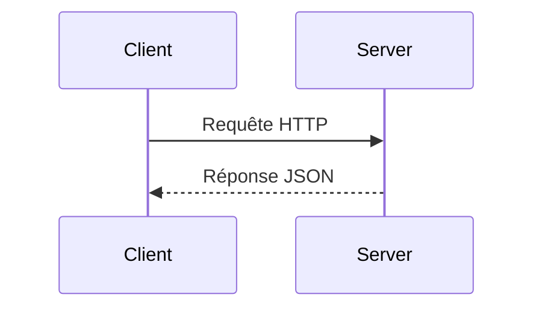
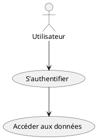

<!--
backgroundImage: url('./images/couverture.png')
backgroundSize: cover
color: white
-->

<br/><br/><br/><br/><br/><br/><br/><br/><br/><br/><br/>
Bertrand Florat 
Meetup Arkup Juin 2025
© 2025 Bertrand Florat – CC BY-SA 4.0 

---
<!--
backgroundImage: none
color: #555555
-->

# 🧭 Agenda (1H)

* 0 - Les enjeux de la documentation (générale et d'architecture)
* 1 - Les challenges de la documentation traditionnelle
* 2 - La documentation d'architectrure As Code
* 3 - RETEX, tips, blueprints
* 4 - Take-away & perspectives

---

# 📚 0 — Les enjeux de la documentation
(en général et en architecture en particulier)

---

## ⚠️ Disclaimer

- La **documentation** est selon moi particulièrement  **incompris** et **mal maîtrisé** par les équipes
- Le plus souvent :  
   - 🗂️ **Trop** de documentation...  
   - 📉 **Pas assez** de documentation...  
   - 📄 **Pas le bon niveau** de documentation...  
   - ☠️ **Documentation morte** (non à jour, jamais lue) 

---
## 📈 Le ROI de la documentation

- **Une activité qui dérappe très facilement :**
  - Documentation inutile, hors sujet, inmaintenable
  - Coût élevé, retour hypothétique voire négatif
  - En **lean**, on appelle ça du **Muda** (gaspillage)

- **Écrire une doc, c'est un engagement :**
  - Beaucoup aiment écrire, peu souhaitent maintenir
  - Écrire implique maintenir dans la durée ⚠️

---

# 📊 Temps passé par un.e architecte à produire de la documentation ?  

- 🧩 Conception & réflexions techniques : 30–40%  
- 📖 **Rédaction de documentation : 20–30% (15% sur projets très agiles, 40% dans secteurs très reglementés** 
- 🤝 Réunions & arbitrages : 20–30%  
- 📢 Communication & vulgarisation : 10–15%  
- 📈 Veille technologique : 5–10%  

---

# 📢 Pourquoi documenter ?  

## 🌍 **Communiquer des informations importantes**  

- 📡 **Dans l’espace** :  
   - Organisations **distribuées**, télétravail, décalage horaire...  
- ⏳ mais surtout **dans le temps** :  
   - Pour les autres : **TMA**, futurs développeurs, architectes…  
   - Pour soi-même dans 6 mois 😅
   - pour les **transferts de compétence**,...   

---

## 🛡️ **Documenter pour avancer**  

- 🚫 Moins de malentendus ➔ **économies** de temps, d’argent et de frustrations
- 📚 **Tracer les choix et leurs raisons** (ex: ADR) ➔ éviter de reposer sans cesse les mêmes questions
- 🔄 *Si besoin, on pourra toujours les réévaluer plus tard... mais en conscience.*  

---


# 📌 Ce que la documentation doit contenir

- **TOUT** ce qui est nécessaire, mais **QUE** ce qui est nécessaire

- 🧪 **Tests de Litmus** : Dois-je documenter ?
  - Une **personne externe compétente** dans le domaine a-elle besoin d'explications complémentaires au code/écrans ? Si non ➔ pas de doc
  - Documenter essentiellement **ce qui ne peut pas être deviné** (ex: respect d'une réglementation)
  - Répondre à la plupart des « **WTF** » d'une nouvelle personne sur le projet
  - Est-ce que je l'**afficherais au mur** dans l'open-space ?

---

# 🚫 Et ne doit pas :

- Contenir du bullshit inutile :
  - **Historique**, **détails inutiles**, **règles de l'art**, éléments **vagues** ou trop généraux

- **Répéter** (principe DRY 🔄) :
  - Préférer référencer les documents existants

- Contenir **des informations ephemères** 

- **Compenser du code peu explicite** (voir Clean Code / Screaming Architecture 📖)

- Être **inadapté** à son audience 🎯

---

## 📋 Petit exemple fonctionnel

Une application d'état civil permet de saisir les dates de naissance avec **trois champs entier** et non pas un **Date Picker**

**WTF ????**

Que doit contenir (ou pas) la doc ?

---

## 💬 Avez vous un problème de doc ? comptez les :

    🙄 "Ça doit être quelque part dans Confluence..."

    😅 "Je l'ai fait, mais je ne sais plus comment..."

    🤔 "Tu peux demander à Maurice, c’est lui qui sait..."

    🫣 "Ah oui, le guide de DEV... mais il n’est plus à jour depuis 2021…"

---
✅ Bonne documentation

    📖 Accessible : trouvable en 2 clics ou via une recherche simple

    🎯 Pertinente : adaptée au public (développeur, ops, manager…)

    🛠️ Actionnable : apporte des exemples concrets, des commandes, des extraits de code

    🔄 Vivante : maintenue à jour, intégrée dans les cycles de développement

❌ Mauvaise documentation

    🕸️ Inaccessible : fichiers perdus, wiki abandonné…

    📚 Encyclopédique : trop de détails inutiles, illisible

    🤷 Vague : « Il faut configurer le proxy »… Mais comment ?

    📅 Périmée : décrit un monde qui n'existe plus

---

## Quid de la documentation d'architecturte en particulier ?

- Tout ce qui a été dit précédemment s'applique aussi aux documents d'architecture

- Préférer les diagrammes au texte (**UML**, **C4**, **BPMN**, **ArchiMate** en particulier) 

- Ne pas hésiter à commenter les diagrammes (directement dans diagramme ou dans le document parent avec des détails pertinents (**tips / warnings**)

- Être honnête :  
  - Lister les hypothèses d’architecture et études en cours dans un chapitre **« Points non statués »** pour chaque vue  
  - L’incertitude doit être **affichée, pas masquée**

---

## 🛑 Les diagrammes : anti-patterns principaux

- Mélange de **niveaux d'abstraction** différents

- Trop d'éléments (**~ > 20**)

- Métaréprésentations floues  
  - Pas de légende  
  - Trop de couleurs, formes, types de flèches  
  - Légendes difficiles à comprendre

- Flèches à **double sens** 🔁 (on ne sait pas qui initie la communication)

---


---

## ✅ Les diagrammes : bonnes pratiques principales

- Métaréprésentations **simples**, niveau d’**abstraction homogène**, **nombre raisonnable** d'élements.

- **Actions explicites sur les flèches**  
  - Indiquer le type d’échange ou de flux  
  - Indiquer la nature du flux (Lecture / Écriture / Exécution) si utile
  
---
### Exemple C4 : diagramme de container


---

# 1 - Le problème avec la documentation traditionnelle

---

## 🗃️ Ce que j'entends par 'documentation traditionnelle'

Répond à la plupart de ses critères :

- **Documents bureautique** binaire Word, PDF, PowerPoint, ... (même partagés)

- **Statique et figée** dès sa publication

- **Mise à jour fastidieuse** -> risque élevé de **rapidement devenir obsolète**

- **Traçabilité des modifications** faible ou manuelle

- Peu intégrée aux **outils et processus de développement**

- Existe uniquement parce comme livrable d'un **procesus, pas orienté produit**

---

## 🗃️ Faible évolutivité et traçabilité

* 🚪 Peu ou pas de **collaboration active** avec les parties prenantes  
  - Décisions prises en silo  
  - Peu adapté aux revues par pair (suivi des modifications mais pas de MR)

* 🕳️ Faible **traçabilité des évolutions**, en particulier sur les **diagrammes** (binaires)

* 🤯 Difficulté en cas de **renommage** ou de réorganisation  
  - Références croisées cassées  
  - Renomages / refactorings risqués et peu pratiques sur un lot de documents

---

## 🗃️ Une doc moins adaptée aux LLM

* 🕳️ Outils bureautiques **peu formels** : structure faible, pas de validation possible du contenu ou des meta-données (type Git hooks)

* 🕳️ Perte de sens en cas d’**entraînement de LLM**  
  - Contenu essentiellement binaire peu structuré, plus difficile à exploiter par l'IA  
  - Plus diffile de faire générer du contenu

---

## 🔒 Plus de risque de fuites

 - Aspiration de drives partagés  
 - Export et diffusion incontrôlés des fichiers
 - Métadonnées oubliées (devis pour un autre client...)
 - 📈 **Volumétrie importante** (surtout en multi-versions)

---

## ⏱️ Des efforts de mise en page importants

  - Trop de temps consacré à la **mise en page** du texte et au **polissage des diagrammes**  
  - Esthétique privilégiée au détriment du fond  
  - Création de **diagrammes figés** qui nécessitent de lourdes reprises pour toute modification
  - Peu de **réutilisation** et pas de factorisation des représentations

---

# 2- Doc as code

## 🏛️ Documentation d'architecture : Traditionnelle vs Vivante (As Code)

| Traditionnelle 📚          | Vivante / As Code 💻          |
|----------------------------|-------------------------------|
| Fichiers Word / PDF statiques | Documentation versionnée (Git)  |
| Mise à jour manuelle        | Mise à jour via PR-MR / CI-CD    |
| Peu ou pas de traçabilité   | Historique, tags et auteurs tracés |
| Rapide obsolescence         | Mise à jour continue          |
| Non intégrée aux workflows  | Intégrée dans le cycle DevOps |
| Lecture linéaire            | Navigation hypertexte         |
| Diagrammes figés             | Diagrammes générés à partir du code (PlantUML, Structurizr) |
| Peu collaborative           | Collaboration via revues de code / merge requests |

🎯 **En résumé :** Passer d’un document que l’on subit à un **actif vivant et maîtrisé** du projet

---

## 🧰 Utiliser Git pour documenter efficacement

-  **Historique complet** : chaque modification est enregistrée  
-  **Tags** : versionnez les jalons de votre documentation (v1.0, v2.0...)  
-  **Blame** : savoir *qui* a écrit *quoi*, et *quand*  
-  **Diffs** : comparaison facile entre deux versions  
-  **Revue via merge request / pull request**  
-  **Revenir dans le temps** : checkout d'une version antérieure  

---

## 🚀 Et au-delà de Git de base

-  **CI/CD** pour valider / publier automatiquement votre doc (PDF, HTML...)  
-  **Git hooks** : automatiser la mise à jour d’index ou de métadonnées  
-  **Traçabilité / conformité** via signature GPG sur commits/tags : utile dans les environnements sensibles  
-  **Collaboration distribuée** : plusieurs auteurs, plusieurs branches  

---

## 📄 L'intrret des langages de balisage légers : AsciiDoc / Markdown

-  **Lisibles en brut** : pas besoin d’outil pour lire ou modifier  
-  **Simplicité** : syntaxe intuitive pour écrire vite  
-  **Facile à générer** : ex : spécificatons exécutables des rapports de tests Spock 
-  **Faciles à versionner** : parfait pour Git (diffs propres, pas de binaire)  
-  **Intégration continue** : générer HTML, PDF, Diagrams, SBOM, etc.  
-  **Extensibles** : AsciiDoc permet des blocs structurés (admonitions, macros, includes...)

---

## 🎯 Idéal pour de la doc "as code"

> Les formats Markdown / AsciiDoc :
> - ✅ s’intègrent naturellement à votre code source (de préférence dans le même dépot)
> - ✅ évitent les formats fermés ou verbeux (Word, PDF, XML)
> - ✅ permettent l’automatisation, la réutilisation et la documentation vivante

📘 Utilisés par : GitHub, GitLab, Red Hat, Spring, Kubernetes...

---
## 🏆 Pourquoi AsciiDoc pour la doc technique avancée ?

- **Structure riche** : sections, blocs, tableaux complexes  
- **Macros & includes** : contenu réutilisable, factorisable  
- **Index, glossaires, bibliographies**  
- **Admonitions** : `NOTE`, `TIP`, `CAUTION`, etc.  
- **Diagrammes intégrés** : PlantUML, Mermaid...  
- **Sorties variées** : HTML5, PDF, DocBook...

---

## 🚀 Antora : plateforme de doc modulaire

-  **Organisation par composants, versions, modules**  
-  **Multi-dépôts Git** : chaque équipe gère sa doc dans son repo  
-  **Mise à jour automatique** des sources  
-  **Navigation unifiée** sur un portail de documentation  
-  **Thématisation et publication pro** (docs produits, API, guides, etc.)

> ✅ Parfait pour la doc d’architecture, microservices, documentation produit distribuée

## ✅ Spécifications exécutables

- Traduction directe d’une **exigence** en un **test automatisé**
- Structurtion des tests en **Gherkin** (Given/when/then)
- Servent à la fois :
  - à **documenter** les comportements attendus
  - à **vérifier** en continu leur respect
- Forme lisible par les humains : développeurs, PO, QA...

---

## 🧪 Exemple de spécification avec Spock

```groovy
class CalculatriceSpec extends Specification {

  def "la somme de #a et #b doit être #result"() {
    expect:
    new Calculatrice().somme(a, b) == result

    where:
    a | b || result
    1 | 2 || 3
    0 | 0 || 0
    -1 | 1 || 0
  }
}
```

---

## 📄 Génération automatique de documentation

- Avec un plugin Spock Reports + conversion AsciiDoc/HTML/PDF
- Exemple de sortie :

```adoc
== Spécification : CalculatriceSpec

=== la somme de #a et #b doit être #result

[cols="1,1,1"]
|===
| a | b | result
| 1 | 2 | 3
| 0 | 0 | 0
| -1 | 1 | 0
|===
```
---

## 🎯 Bénéfices concrets

- Plus de divergence entre code/test/doc
- Vérifiables automatiquement à chaque build
- Réutilisables pour l'audit, l'architecture, etc.

## 🔄 Exemple de site Antora multi-dépots à partir de documentation générée

Spécifications 


## 🛠️ Outils de diagrammes textuels

- Description des **diagrammes en texte brut**
- Stockables en Git, versionnables, diffables
- Intégrables dans les docs AsciiDoc/Markdown
- Génération automatique dans les CI/CD

**Exemples populaires :**
- **Mermaid** : natif Markdown, supporté par GitHub, Obsidian...
- **PlantUML** : plus riche, très utilisé en architecture logicielle
- **Kroki** : agrege ˜20 outils

---

### ✍️ Exemples de syntaxe

#### Mermaid (séquence)



#### PlantUML (use case)



> Résultat : un diagramme lisible, versionnable, reproductible !

---

### 🔧 Autres outils de diagrammes textuels

| Outil              | Points forts                                       | Format(s)      |
|-------------------|----------------------------------------------------|----------------|
| **Graphviz / DOT** | Graphes orientés (DAG, dépendances)               | `.dot`         |
| **Draw.io CLI**    | GUI + export CLI (semi-textuel)                   | `.drawio`      |
| **Structurizr DSL**| Vue C4 modélisée textuellement                    | `.dsl`         |
| **Nomnoml**        | UML simplifié avec une syntaxe markdown-like      | `.nomnoml`     |
| **Kroki**          | Service centralisé pour +10 formats               | API, remote    |

---

### ⚙️ Intégrations populaires

- **IDE** :
  - **IntelliJ** : support natif PlantUML, Mermaid via plugins
  - **VS Code** : extensions Mermaid, PlantUML, Graphviz
  - **Obsidian** : Mermaid intégré, PlantUML via plugins
- **Docs** : Antora, MkDocs, Asciidoctor
- **CI/CD** : génération automatique via CLI ou Kroki
- **Plateformes** : GitHub, GitLab (prévisualisation automatique)


## 📚 Confusion des concepts

- Solutions décrites **sans les exigences et contraintes correspondantes**  

- Mélange fréquent entre :  
  - **Contraintes** (imposées par le contexte)  
  - **Exigences** (attendues par le métier)  
  - **Solutions** (choix technologiques)  

- Résultat :  
  - Perte de lisibilité  
  - Difficulté pour justifier les choix faits

---


Takeaway

Présentatrion disponible à https://florat.net


---

Aller plus loin :

La living documentation (pointeur vers Cyril Martraire)


----


2)  La documentation Archi As Code
x Utilisation de Git (et tous ses utilitaires et features)
Utilisation de langages de balisages légers pour le text (Asciidoc / markdown)
Utilisation de diagrammes textuels (plantuml/mermaid..)
C4
Le Mob Design en équipe
La notion de coordonnées d'archi pour s'y retrouver rapidement
Modèle de DA orienté usage et orienté checklist
Les ADR
De l'importance de l'Ubiquitous Language
Les suivi de réunions
Les supports (Marp, reveal.js...)
Intégration dans une CI (exports...)
La documentation multi-dépôts avec Antora
Possibilité de découpage par type de public pour cibler le contenu
Possibilité de filtrage par contexte (ex: pour un projet d'ETL, pas besoin des sections portant sur les GUI)
Possibilité de faire des scripts pour avoir un taux d'avancement / remplissage ? -> Bonne idée !
script avec des extractions automatique ( scan d'infra par exemple, analyse du paramétrage dans le code ou CMDB ?)  -> [BFL] A discuter, souvent une fausse bonne idée de mon expérience et faible ROI. 


3) Les challenges /REX
Comment faire pour que cette documentation technique ne soit pas qu'a la main / en responsabilité de l'archi -> Écriture / MR par les non techniques (mais filtrage)
Export PDF/HTML... -> mise en place dans la CI au MAE, export en 1 clic
Comment faire lire le DA par les devs et autres parties prenantes  ? -> syllabus , quiz
Cohabitation avec d'autres systèmes documentaires (ex: doc infra sur un autre wiki)
Taille du modèle -> découper par filtres contextuels (en cours). Contextes par organisation et/ou projet.
Petits projets / Manque d'architectes, quand les chefs de projet font l'architecture.
Les contextes propices/ non propices
Dichotomie DA/guide de développement (pour les solutions surtout)
Dichotomie DA / DEX : ne pas mélanger, pas les mêmes temporalités / confidentialité des infos.
Comment valider/suivre le cycle de vie du DA par le management ? s'impliquer dans la réalisation/qualité du DA.
Attention à ne pas confondre exigences et solution.
Problème de la maintenance toujours présent. Quelques solutions, la revue globale périodique.
Solution 'loin' des exigences -> exige des hyperliens
Business Analysts  sur specs générales: une approches Wysysig type Confluence peut être préférable (problème d’adhésion), pas de solution unique

4) Conclusion
Vers un outil Open Source (SaaS / on Prem ? ) de gestion/génération des modèles de DA/ADR ?
Aller plus loin : pointeurs vers 'Living documentation' de Cyrill Martraire , etc
