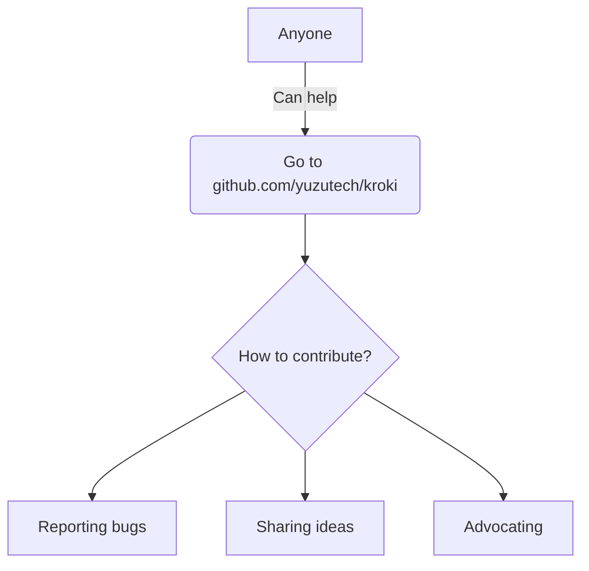
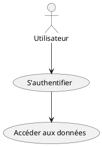

<!--
backgroundImage: url('./images/couverture.png')
backgroundSize: cover
color: white
-->

<br/><br/><br/><br/><br/><br/><br/><br/><br/><br/><br/>
Meetup Arkup Juin 2025
https://meetup-arkup-juin-2025.florat.net/
© 2025 Bertrand Florat – CC BY-SA 4.0 

---
<!--
backgroundImage: none
color: #555555
-->

# 🧭 Agenda (1H)

* 0 - Les enjeux de la documentation (générale et d'architecture)
* 1 - Les challenges de la documentation traditionnelle
* 2 - La documentation d'architectrure As Code
* 3 - RETEX, tips, blueprints
* 4 - Take-away & perspectives

---

# 📚 0 — Les enjeux de la documentation
(en général et en architecture en particulier)

---

## ⚠️ Disclaimer

- La **documentation** est selon moi particulièrement  **incompris** et **mal maîtrisé** par les équipes
- Le plus souvent :  
   - 🗂️ **Trop** de documentation...  
   - 📉 **Pas assez** de documentation...  
   - 📄 **Pas le bon niveau** de documentation...  
   - ☠️ **Documentation morte** (non à jour, jamais lue) 

---
## 📈 Le ROI de la documentation

- **Une activité qui dérappe très facilement :**
  - Documentation inutile, hors sujet, inmaintenable
  - Coût élevé, retour hypothétique voire négatif
  - En **lean**, on appelle ça du **Muda** (gaspillage)

- **Écrire une doc, c'est un engagement :**
  - Beaucoup aiment écrire, peu souhaitent maintenir
  - Écrire implique maintenir dans la durée ⚠️

---

# 📊 Temps passé par un.e architecte à produire de la documentation ?  

- Conception & réflexions techniques : 30–40%  
- **Rédaction de documentation : 20–30% (15% sur projets très agiles, 40% dans secteurs très reglementés** 
- Réunions & arbitrages : 20–30%  
- Communication & vulgarisation : 10–15%  
- Veille technologique : 5–10%  

---

# 📢 Pourquoi documenter ?  

## 🌍 **Communiquer des informations importantes**  

- 📡 **Dans l’espace** :  
   - Organisations **distribuées**, télétravail, décalage horaire...  
- ⏳ mais surtout **dans le temps** :  
   - Pour les autres : **TMA**, futurs développeurs, architectes…  
   - Pour soi-même dans 6 mois 😅
   - pour les **transferts de compétence**,...   

---

## 🛡️ **Documenter pour avancer**  

- 🚫 Moins de malentendus ➔ **économies** de temps, d’argent et de frustrations
- 📚 **Tracer les choix et leurs raisons** (ex: ADR) ➔ éviter de reposer sans cesse les mêmes questions
- 🔄 *Si besoin, on pourra toujours les réévaluer plus tard... mais en conscience.*  

---


# 📌 Ce que la documentation doit contenir

- **TOUT** ce qui est nécessaire, mais **QUE** ce qui est nécessaire

- 🧪 **Tests de Litmus** : Dois-je documenter ?
  - Une **personne externe compétente** dans le domaine a-elle besoin d'explications complémentaires au code/écrans ? Si non ➔ pas de doc
  - Documenter essentiellement **ce qui ne peut pas être deviné** (ex: respect d'une réglementation)
  - Répondre à la plupart des « **WTF** » d'une nouvelle personne sur le projet
  - Est-ce que je l'**afficherais au mur** dans l'open-space ?

---

# 🚫 Et ne doit pas :

- Contenir du bullshit inutile :
  - **Historique**, **détails inutiles**, **règles de l'art**, éléments **vagues** ou trop généraux

- **Répéter** (principe DRY 🔄) :
  - Préférer référencer les documents existants

- Contenir **des informations ephemères** 

- **Compenser du code peu explicite** (voir Clean Code / Screaming Architecture 📖)

- Être **inadapté** à son audience 🎯

---

## 📋 Petit exemple fonctionnel

Une application d'état civil permet de saisir les dates de naissance avec **trois champs entier** et non pas un **Date Picker**

**WTF ????**

Que doit contenir (ou pas) la doc ?

---

## 💬 Avez vous un problème de doc ? comptez les :

    🙄 "Ça doit être quelque part dans Confluence..."

    😅 "Je l'ai fait, mais je ne sais plus comment..."

    🤔 "Tu peux demander à Maurice, c’est lui qui sait..."

    🫣 "Ah oui, le guide de DEV... mais il n’est plus à jour depuis 2021…"

---
✅ Bonne documentation

  * **Accessible** : trouvable en 2 clics ou via une recherche simple
  * **Pertinente** : adaptée au public (développeur, ops, manager…)
  * **Actionnable** : apporte des exemples concrets, des commandes, des extraits de code
  * **Vivante** : maintenue à jour, intégrée dans les cycles de développement

❌ Mauvaise documentation

  * **Inaccessible** : fichiers perdus, wiki abandonné…
  * **Encyclopédique** : trop de détails inutiles, illisible
  * **Vague** : « Il faut configurer le proxy »… Mais comment ?
  * **Périmée** : décrit un monde qui n'existe plus

---

## 📖 La documentation vivante (Cyrille Martraire)

> « Une documentation fiable, utile, et toujours à jour. »

### ✨ Principes clés

- ✅ **Fiable** : toujours en phase avec le logiciel livré, à tout moment  
- ⚙️ **À faible effort** : facile à maintenir, même lors de changements  
- 🤝 **Collaborative** : favorise les échanges et le partage de savoir  
- 🔎 **Porteuse de sens** : met en lumière les enjeux, déclenche des retours, et aide à mieux décider

---

## Quid de la documentation d'architecturte en particulier ?

- Tout ce qui a été dit précédemment s'applique aussi aux documents d'architecture

- Préférer les diagrammes au texte (**UML**, **C4**, **BPMN**, **ArchiMate** en particulier) 

- Ne pas hésiter à commenter les diagrammes (directement dans diagramme ou dans le document parent avec des détails pertinents (**tips / warnings**)

- Être honnête :  
  - Lister les hypothèses d’architecture et études en cours dans un chapitre **« Points non statués »** pour chaque vue  
  - L’incertitude doit être **affichée, pas masquée**

---

## 📚 Les documentations principales de l'architecte

- 🏗️ **Dossier d’Architecture (DA)**  
  Vue d’ensemble des choix, contextes, exigences et contraintes

- 🧠 **ADR – Architecture Decision Records**  
  Journal des décisions d’architecture, horodatées et justifiées

- 📝 **Suivi des points d’architecture**  
  Comptes-rendus des réunions, discussions et arbitrages techniques

- 🔐 **Études techniques (sécurité, performance, etc.)**  
  Analyses approfondies pour justifier ou évaluer des solutions

- 🧪 **POC – Proof of Concept**  
  Expérimentations techniques pour valider une hypothèse ou un risque

- 🎤 **Supports de présentation**  
  Slides pour comités d’architecture, parties prenantes, équipes

---

_Tous ces artefacts doivent être vivants, partagés, versionnés et liés au contexte métier._

---

## 🛑 Les diagrammes : anti-patterns principaux

- Mélange de **niveaux d'abstraction** différents

- Trop d'éléments (**~ > 20**)

- Métaréprésentations floues  
  - Pas de légende  
  - Trop de couleurs, formes, types de flèches  
  - Légendes difficiles à comprendre

- Flèches à **double sens** 🔁 (on ne sait pas qui initie la communication)

---


---

## ✅ Les diagrammes : bonnes pratiques principales

- Métaréprésentations **simples**, niveau d’**abstraction homogène**, **nombre raisonnable** d'élements.

- **Actions explicites sur les flèches**  
  - Indiquer le type d’échange ou de flux  
  - Indiquer la nature du flux (Lecture / Écriture / Exécution) si utile
  
---
### Exemple C4 : diagramme de container


---

# 1 - Le problème avec la documentation traditionnelle

---

## 🗃️ Ce que j'entends par 'documentation traditionnelle'

Répond à la plupart de ses critères :

- **Documents bureautique** binaire Word, PDF, PowerPoint, ... (même partagés)

- **Statique et figée** dès sa publication

- **Mise à jour fastidieuse** -> risque élevé de **rapidement devenir obsolète**

- **Traçabilité des modifications** faible ou manuelle

- Peu intégrée aux **outils et processus de développement**

- Existe uniquement parce comme livrable d'un **procesus, pas orienté produit**

---

## 🗃️ Faible évolutivité et traçabilité

* Peu ou pas de **collaboration active** avec les parties prenantes  
  - Décisions prises en silo  
  - Peu adapté aux revues par pair (suivi des modifications mais pas de MR)

* Faible **traçabilité des évolutions**, en particulier sur les **diagrammes** (binaires)

* Difficulté en cas de **renommage** ou de réorganisation  
  - Références croisées cassées  
  - Renomages / refactorings risqués et peu pratiques sur un lot de documents

---

## 🗃️ Une doc moins adaptée aux LLM

* Outils bureautiques **peu formels** : structure faible, pas de validation possible du contenu ou des meta-données (type Git hooks)

* Perte de sens en cas d’**entraînement de LLM**  
  - Contenu essentiellement binaire peu structuré, plus difficile à exploiter par l'IA  
  - Plus diffile de faire générer du contenu

---

## 🔒 Plus de risque de fuites

 - Aspiration de drives partagés  
 - Export et diffusion incontrôlés des fichiers
 - Métadonnées oubliées (devis pour un autre client...)
 - 📈 **Volumétrie importante** (surtout en multi-versions)

---

## ⏱️ Des efforts de mise en page importants

  - Trop de temps consacré à la **mise en page** du texte et au **polissage des diagrammes**  
  - Esthétique privilégiée au détriment du fond  
  - Création de **diagrammes figés** qui nécessitent de lourdes reprises pour toute modification
  - Peu de **réutilisation** et pas de factorisation des représentations

---

# 2- Doc as code

## 🏛️ Documentation d'architecture : Traditionnelle vs Vivante (As Code)

| Traditionnelle 📚          | Vivante / As Code 💻          |
|----------------------------|-------------------------------|
| Fichiers Word / PDF statiques | Documentation versionnée (Git)  |
| Mise à jour manuelle        | Mise à jour via PR-MR / CI-CD    |
| Peu ou pas de traçabilité   | Historique, tags et auteurs tracés |
| Rapide obsolescence         | Mise à jour continue          |
| Non intégrée aux workflows  | Intégrée dans le cycle DevOps |
| Lecture linéaire            | Navigation hypertexte         |
| Diagrammes figés             | Diagrammes générés à partir du code (PlantUML, Structurizr) |
| Peu collaborative           | Collaboration via revues de code / merge requests |

🎯 **En résumé :** Passer d’un document que l’on subit à un **actif vivant et maîtrisé** du projet

---

## 🧰 Utiliser Git pour documenter efficacement

-  **Historique complet** : chaque modification est enregistrée  
-  **Tags** : versionnez les jalons de votre documentation (v1.0, v2.0...)  
-  **Blame** : savoir *qui* a écrit *quoi*, et *quand*  
-  **Diffs** : comparaison facile entre deux versions  
-  **Revue via merge request / pull request**  
-  **Revenir dans le temps** : checkout d'une version antérieure  

---

## 🚀 Et au-delà de Git de base

-  **CI/CD** pour valider / publier automatiquement votre doc (PDF, HTML...)
-  **Git hooks** : automatiser la mise à jour d’index ou de métadonnées  
-  **Traçabilité / conformité** via signature GPG sur commits/tags : utile dans les environnements sensibles  
-  **Collaboration distribuée** : plusieurs auteurs, plusieurs branches  

---

## 📄 L'intéret des langages de balisage légers : AsciiDoc / Markdown

-  **Lisibles en brut** : pas besoin d’outil pour lire ou modifier  
-  **Simplicité** : syntaxe intuitive pour écrire vite  
-  **Facile à générer** : ex : spécificatons exécutables des rapports de tests Spock 
-  **Faciles à versionner** : parfait pour Git (diffs propres, pas de binaire)  
-  **Intégration continue** : générer HTML, PDF, Diagrams, SBOM, etc.  
-  **Extensibles** : AsciiDoc permet des blocs structurés (admonitions, macros, includes...)

---

## 🎯 Idéal pour de la doc "as code"

> Les formats Markdown / AsciiDoc :
> - ✅ s’intègrent naturellement à votre code source (de préférence dans le même dépot)
> - ✅ évitent les formats fermés ou verbeux (Word, PDF, XML)
> - ✅ permettent l’automatisation, la réutilisation et la documentation vivante

📘 Utilisés par : GitHub, GitLab, Red Hat, Spring, Kubernetes...

---
## 🏆 Pourquoi AsciiDoc pour la doc technique avancée ?

- **Structure riche** : sections, blocs, tableaux complexes  
- **Macros & includes** : contenu réutilisable, factorisable  
- **Index, glossaires, bibliographies**  
- **Admonitions** : `NOTE`, `TIP`, `CAUTION`, etc.  
- **Diagrammes intégrés** : PlantUML, Mermaid...  
- **Sorties variées** : HTML5, PDF, DocBook...

---

## 🚀 Antora : plateforme de doc modulaire

-  **Organisation par composants, versions, modules**  
-  **Multi-dépôts Git** : chaque équipe gère sa doc dans son repo  
-  **Mise à jour automatique** des sources  
-  **Navigation unifiée** sur un portail de documentation  
-  **Thématisation et publication pro** (docs produits, API, guides, etc.)

> ✅ Parfait pour la doc d’architecture, microservices, documentation produit distribuée

---

## ✅ Les Spécifications Exécutables

- Traduction directe d’une **exigence** en un **test automatisé**
- Structuration des tests en **Gherkin** (Given/When/Then)
- Servent à la fois :
  - à **documenter** les comportements attendus
  - à **vérifier** en continu leur respect
- Forme lisible par les humains : développeurs, PO, QA...

---

## 🧪 Exemple de spécification avec Spock

```groovy
class CalculatriceSpec extends Specification {

  def "La somme de deux nombres – Gherkin style"() {
    given: "une calculatrice"
    def calculatrice = new Calculatrice()

    when: "je calcule la somme de #a et #b"
    def resultat = calculatrice.somme(a, b)

    then: "le résultat doit être #result"
    resultat == result

    where:
    a  | b  || result
    1  | 2  || 3
    0  | 0  || 0
    -1 | 1  || 0
  }
}
```

---

## 📄 Génération automatique de documentation

- Avec un plugin Spock Reports + conversion AsciiDoc/HTML/PDF
- Exemple de sortie :

```adoc
== Spécification : CalculatriceSpec

=== la somme de #a et #b doit être #result

[cols="1,1,1"]
|===
| a | b | result
| 1 | 2 | 3
| 0 | 0 | 0
| -1 | 1 | 0
|===
```
---

## 🎯 Bénéfices concrets

- Plus de divergence entre code/test/doc
- Vérifiables automatiquement à chaque build
- Réutilisables pour l'audit, l'architecture, etc.

---

## 🔄 Exemple de site Antora multi-dépots à partir de documentation générée

Spécifications 


---

## 🛠️ Outils de diagrammes textuels

- Description des **diagrammes en texte brut**
- Stockables en Git, versionnables, diffables
- Intégrables dans les docs AsciiDoc/Markdown
- Génération automatique dans les CI/CD

**Exemples populaires :**
- **Mermaid** : natif Markdown, supporté par GitHub, Obsidian...
- **PlantUML** : plus riche, très utilisé en architecture logicielle
- **Kroki** : agrege une vngtaine d'outils

---

### ✍️ Exemples de syntaxe

#### Mermaid (séquence)



#### PlantUML (use case)



> Résultat : un diagramme lisible, versionnable, reproductible !

---

### 🔧 Autres outils de diagrammes textuels

| Outil              | Points forts                                       | Format(s)      |
|-------------------|----------------------------------------------------|----------------|
| **Graphviz / DOT** | Graphes orientés (DAG, dépendances)               | `.dot`         |
| **Draw.io CLI**    | GUI + export CLI (semi-textuel)                   | `.drawio`      |
| **Structurizr DSL**| Vue C4 modélisée textuellement                    | `.dsl`         |
| **Nomnoml**        | UML simplifié avec une syntaxe markdown-like      | `.nomnoml`     |
| **Kroki**          | Service centralisé pour +10 formats               | API, remote    |

---

### ⚙️ Intégrations populaires

- **IDE** :
  - **IntelliJ** : support natif PlantUML, Mermaid via plugins
  - **VS Code** : extensions Mermaid, PlantUML, Graphviz, Kroki
  - **Obsidian** : Mermaid intégré, PlantUML via plugins
- **Docs** : Antora, MkDocs, Asciidoctor
- **CI/CD** : génération automatique via CLI ou Kroki
- **Plateformes** : GitHub, GitLab (prévisualisation automatique)

---

## 🧱 Le modèle C4 — Définition

- Un ensemble d’**abstractions hiérarchiques** :  
  *systèmes logiciels*, *conteneurs*, *composants*, et *code*

- Un ensemble de **diagrammes hiérarchiques** :  
  *contexte système*, *conteneurs*, *composants*, et *code*

- **Indépendant de la notation**  
  (UML, texte, diagramme libre…)

- **Indépendant des outils**  
  (Structurizr, PlantUML, AsciiDoc, etc.)

---

## 🧱 Le modèle C4 — diagrammes


Source: https://c4model.com/

---

## 💡 C4 dans la vraie vie

<!-- _class: small -->

* Coupler à Plantuml (intégré de base maintenant)
* Mes diagrammes préférés
  * Système Landscape (en ra)mplcement au Context) et servant pour l'architecture générale
  * Diagramme de container* : de loin le plus utilisé
  * Diagrammes de déploiement pour les diagrammes d'infrastrcture.
* Les diagrammes dynamiques au format séquences sont une version améliorée d'un diagramme de séquence.   
* Eviter trop de diagrammes de composant (conception détaillée -> risque de sur-documentation) et de code (UML) 
* Utiliser les sprites (milliers inclus de base dans plantuml)
* Moins adapté qu'Archimate dans certains cas (EA, TOGAF, outillage existant...)


<div class="admonition tip">
  💡 (*) Je n'aime pas le terme <i>diagramme de containeur</i> J'utilise à la place le terme <i>diagramme d'unités déployables</i>.
</div>

---

## 💡 Exemple de C4 en plantuml


```
@startuml
   !include <C4/C4_Container>
   !include <tupadr3/devicons2/chrome>
   !include <tupadr3/devicons2/java>
   !include <tupadr3/devicons2/postgresql>
   LAYOUT_LEFT_RIGHT()
   Container(browser, "Browser","Firefox or Chrome", $sprite="chrome")
   Container(api_a, "API A","Spring Boot", $sprite="java")
   ContainerDb(db_a, "Database A","Postgresql", $sprite="postgresql")
   Rel(browser,api_a,"HTTPS")
   Rel_R(api_a,db_a,"pg")
@enduml
```

---

## 🥷 La factorisation des diagrammes
<!-- _class: small -->
Les diagrammes As Code permettent la factorisation de librairies (à utiliser en plantuml avec `remove @unlinked`) :

```
fragments.iuml:

!startsub dmz
  Container(browser, "Browser","Firefox or Chrome", $sprite="chrome")
  Container(api_a, "API A","Spring Boot", $sprite="java")
  Container(api_b, "API B (hors contexte)","Python", $sprite="python")
!endsub
!startsub intranet
  ContainerDb(db_a, "Database A","Postgresql", $sprite="postgresql")  
!endsub
!startsub extranet
  ContainerDb(db_b, "Database B","Postgresql", $sprite="postgresql")
!endsub

File diags-1.puml:
@startuml use-case-1
  remove @unlinked
  !includesub fragments.iuml!dmz
  !includesub fragments.iuml!intranet
    
  Rel(browser,api_a,"HTTPS")
  Rel_R(api_a,db_a,"pg")
@enduml
```

---

## 🥷 Pattern : diagrammes d'inventaire

* Regrouper les unités déployables dans des 'librairires' reutilsiables et découpés en zones. Intégrer dans le DA (vue applicative) la big picture de l'inventaire sans relations.


---

## 🥷 Pattern : diagrammes dynamiques

* Intégrer dans le DA (vue applicative) la big picture des dépenedances principales


---
## 🥷 Pattern : diagrammes de chaine de liaison 

* Et pour chaque feature, découper en chaine de laiison synchrones :


---

## 🥷 La notion de coordonnées d'architrecture

* Si un DA contient des dizaines voire centaines de diagrammes, difficile de s'y référer (pour discutter d'un flux precis en PROD par exemple)
* Nous découpons nos features en x chaines de liaison synchrones de n appels 
* Exemple de corrdonnées du flux 5 de la chaine de laison 3 de la feature enregistrement de la commande :  `timeout sur com-3:5` -> à utiliser dans les tickets et post-mortems.

---

## Le Dossier d'Architecture As Code

* Basé sur du light markup (ASCIIDOC de préférence)
* et sur des diagrammes textuels
* Utilisation de Git et des Merge Requests pour la collaboration
* Peut être rendus et consolidé dans un site Antora
* "Développé" dans un IDE (VSCode est mon préféré)
* Mis à jour en continu + revue annuelle complète.

---

## 📘 Mon modèle de dossier d'architecture
<!-- _class: small -->


**https://github.com/bflorat/modele-da**


* Découpe l'architecture solution en **cinq vues**
* Structure chaque vue en **contraintes** / **exigences (ENF)** / **solution**
* Orienté **'check-list'** : aide à ne pas oublier de sujets importants
* **Intégère l'incertitude** (hypothèses / points à statuer...)
* Licence **CC** Attribution Share-Alike
* Existe aussi en **anglais**
* **Pret à l'utilisation** (modèles vierges, manuel, outils d'exports...)
* Amélioration continue
* Contributions appréciées

---

## Les ADR (Architecture Decision Record)

<!-- _class: small -->

* Un DA de doit intégrer **que la solution retenue**
* L'**historisation des choix** et leur raisons figure dans les ADR associés 
* But : **permettre la connaissance et la compréhension des choix *aposteriori* et de partager les décisions**
* Un bon ADR doit etre **court, clair, pertinent, accessible, tracés (dans Git), transparent**
* Plusieurs formats, je suggère celui de ThoughtWork : 
  . **Historique** et statut courant avec nom des validateurs
  . **Contexte** (présentation de la problématique et des choix proposés). Intégre une analyse rapide de chaque solution envisagée (Avantage/inconvenient ou SWOT)
  . **Décision** : choix clair identifiant de façon non ambigue la solution retenue (ex: _Solution 2 retenue_)
  . **Conséquences** : conséquences pratiques de la décision (prévoir un budget dédié, un nouvel outil de suivi...)


<div class="admonition tip">
  💡 Article complet sur le sujet [ici](https://florat.net/comment-faire-de-bons-adr/)
</div>

---

## Exemple de bon ADR

<!-- _class: small -->

```
    ## Historique
    Statut: `VALIDE`

    * Validé par xyz le 28 janvier
    * Proposé par z le 02/01/2020

    ## Contexte

    <Présentation générale de la problématique>

    # Solution 1: <description solution>
    ## Forces
    - Limite l'utilisation du réseau

    ## Faiblesses
    - Moins robustesse

    ## Opportunités

    ## Risques
    - [rédhibitoire] Nécessite que la signature se fasse en synchrone ou en fil l'eau

    # Solution 2: <description solution>
    ## Forces
    ## Faiblesses
    ## Opportunités
    ## Risques

    ## Décisions
    La solution 2 est retenue

    ## Conséquences
    - Vérifier la configuration des JVM pour utiliser un générateur d'aléas

```

---

## 🥷 Consolidation automatique des ADR

Avec les tags ASCIIDOC, possible de consilider le statut de toutes les ADR dans un tableau récapitulatif :

```
.Table Liste et statuts des ADR RECE
[cols="2,1a,4a"]
|===
|ADR |Statut |Historique

|link:001-dedoublonnage-requetes.adoc[001-dedoublonnage-requetes]
|include::001-dedoublonnage-requetes.adoc[tags=statut]
|include::001-dedoublonnage-requetes.adoc[tags=historique]

|link:002-appels-synchrones.adoc[002-appels-synchrones]
|include::002-appels-synchrones.adoc[tags=statut]
|include::002-appels-synchrones.adoc[tags=historique]
...
|===
```

---

# 🗣️ L'importance de L'UL (Ubiquitus Language)

- UL issu du **Domain-Driven Design (DDD)** d’Eric Evans  
- Objectif : **un langage partagé** entre développeurs, experts métier, testeurs et architectes  
- Le DA (dossier d'architecture) **doit refléter ce langage** :
  - 📘 Utiliser **les mêmes termes métier** partout (code, doc, tests, diagrammes)  
  - 🚫 **Éviter les synonymes** et les variations  
- 🤝 Favorise la compréhension entre les parties prenantes  
- 🔎 Améliore la traçabilité des concepts métier  
- ✅ Garantit la cohérence entre code et documentation  

---

# Le CR de point architecture

- **"Commite" le point**. Sans CR, la réunion n'a jamais eu lieu.
- **Complète les ADR**, permet de justifier et remonter dans le passer
- Fondamental pour un architecte, **permet de remetre les idées en clair**
- Une fois le CR validé, **mettre à jour le DA et/ou les ADR**
- Les écrire en **light markup** (ASCIIDOC de préférence) et tous les conserver, si possible dans des fichiers les regroupant pour facilité la recherche (CTRL-F)
- Envoyer le **lien par mail**
- Accepter les **corrections/compléments** par MR de préférence.
- **Format conseillé** : Date / liste des partinipant.e.s / Informations / Décisions / Actions (**SMART**)

---

# 🖥️ Les supports de présentation *as code*


## 🎯 Pourquoi présenter *as code* ?

- **Écriture textuelle** simple (Markdown, AsciiDoc)
- **Versionnable** avec Git
- **Réutilisable** et automatisable
- **Moins de dépendances propriétaires** (PowerPoint, Google Slides) / gratuit
- **Support des LLM** (mise en page, ex: émoticons / rédaction / orthographe ) et facile à parser pour alimenter un modèle d'architecture interne. Productivité x2.

<div class="admonition tip">
  💡 Ce support a été écrit en Marp avec assistance de ChatGPT 4o + Le Chat 7B, source sur https://github.com/bflorat/meetup-arkup-juin-2025.github.io.
</div>

---

## 🛠️ Outils Open Source populaires

| Outil         | Langage     | Caractéristiques clés                        |
|---------------|-------------|----------------------------------------------|
| **Marp**      | Markdown    | Compatible avec VS Code, export PDF/HTML     |
| **Reveal.js** | HTML/Markdown | Hautement personnalisable avec JS/CSS      |
| **Asciidoctor Reveal.js** | AsciiDoc | Reveal.js mais en Asciidoc          |

---

## 🤖 Tirer profil de la CI-CD pour la documentation As Code

* **Exports automatiquess en différents formats 
  * Le mieux : **archive contenant les HTML et diagrammes en SVG**
  * PDF : rendu correct mais pas toujours optimal (surtout pour les grands diagrammes)
  * Docx/ODT : bof...
* **Traitements automatiques** (ex: ajout d'includes, ajout de notice de copyright, découpage/filtrage par public visé...)
* Analyses et contrôles : 
  * Vérification copyright / de données sensibles
  * Production d'indicateurs de taux d'avancement du remplacissage d'un DA...
* Géénration de doc depuis le code. Exemple : annotations @Good dans le code -> on exporte la classe dans une docuemntation Antora pour servir d'exemple aux nouveaux arrivants.

---

## 🔎 La doc au plus pret du code mais où ?

* Positionner la conception détaillée dans le dépot Git du projet lui-même.
* Sur un petit projet mono-module, mettre le DA avec le code du projet.
* Sur la plupart des projets, je conseille de prévoir un dépot Git dedié à la documentation et comprenant le DA, le suivi (CR), les ADR, les études...

---

## 🛰️ Archi As Code et IA

* Texte ? çà vous rapelle quelque chose ? les LLM ?
* Il est en theorie possible de conxtruire aujourd'hui un chatbot orienté architecture et spécifique à l'organisation.
* Objectif : respituer aux devs les régles d'architecture de façon rapide et ludique

---
## 🧸 Petit POC : ArchBot

* Entrainé sur les documents d'architecture Asciidoc et Plantuml
* Stack: RAG (Retrieval-Augmented Generation) basé sur modèles Mistral 7B ou DeepSeek-V2
* POC en local sur mon PC
* Résultats mitigés, largement meilleurs en `mistral-7b`
* Extrement lent mais pas encore testé sur du matériel adapté


---
## 🧸 Exemple d'utilisation

### Pré-prompt

```
Tu es un assistant expert en architecture solutions qui répond UNIQUEMENT en français. 
Tu ne travaille que sur un seul projet : FOO. Tu t'appelles 'ArchBot'.
Tes réponses doivent être précises et basées sur les documents techniques fournis.
Si tu ne trouves pas d'information pertinente dans les documents, réponds simplement : 
"Je n'ai pas trouvé d'information pertinente sur ce sujet dans les documents."
Ne fais AUCUNE supposition ni invention.
```

### Utilisation (GUI: Gradio)


---


# 🧨 3 - Les challenges de la documentation As Code

---

## ❄️ Cela reste de la documentation froide


---

## 😓 La documentation, même As Code, c'est difficile

* Exige de bonnes capacités redactionnelles
* Mais surtout de l'empathie pour trouver le bon niveau de détail (pas trop basique ni trop difficile pour quelqu'un de ,normalement compétent dans le domaine)
* Wiio’s Laws :

>Communication usually fails except by accident.
If communication can fail, it will.
If communication cannot fail, it still most usually fails.
If communication seems to succeed in the intended way, there’s a misunderstanding.
If you are content with your message, communication certainly fails.
If a message can be interpreted in several ways, it will be interpreted in a manner that maximizes the damage.
[...]


---

## 😱 Epouvante chez les CP ou BA qui ont vu du Markdown

* Dans de la plupart des cas (RETEX), il n'est pas envisageable de faire faire du light markup ou des diagrammes as code aux non techniques.
* Blocage de nombreux non-tech avec Gitlab ou Github.
* Notre solution : filiere dediée pour eux sur du Wiki Confluent-like comme [xwiki](https://www.xwiki.org/xwiki/bin/view/Main/WebHome) ou [BookStack](https://www.bookstackapp.com/) avec intégration [diagrams.net](https://app.diagrams.net/) (ex Draw.io).

<div class="admonition tip">
  💡 Même si c'est moins agreable conceptuellement et qu'il ne faut pas les multiplier, je ne crois pas à une solution unique de doucmentation. L'approche Best of Breed est ici préférable.
</div>

---

## 🔄 Comment transférer le DA depuis GitLab vers nos prestataires ?

### 📦 1. Export via CI/CD

- Utiliser une **pipeline CI/CD** pour générer automatiquement :
  - une **archive ZIP**, ou  
  - un **PDF du dossier d'architecture**
- Permet un transfert simple et traçable

### 🔐 2. Pour les docs sensibles

- Préférer un **accès contrôlé au dépôt Git**
  - Restriction des **droits d’accès réseau** et **applicatifs**
  - 🔍 Suivi des accès et historique Git

---

## ✅ Comment s'assurer que le DA est lu et compris ?

### 🧭 Bonnes pratiques appliquées chez nous :

- 📘 **Livret d'accueil**  
  Contient les sections du DA à lire en fonction du **rôle** (dev, PO, ops…).

- ❓ **Quiz d'assimilation**  
  ~50 questions (30 min), suivi de **4h de débrief avec un architecte**, 1 mois après l’arrivée.

- 📩 **Communication proactive**  
  Envoi de **mails ou messages** à chaque évolution du DA, avec lien direct ou extrait ciblé.


---

## 🎯 Manque de contextualisation de certains modèles de DA

- Certains modèles d'architecture (comme le mien) sont **trop larges**, peuvent être **chronophages** et **intimidants** pour leurs utilisateurs.

- Il est essentiel de **filtrer les sections par contexte** :
  - Par **typologie d'architecture**  
    (ex : applicative, technique, métier)
  - Par **filière technologique**  
    (ex : projet mobile, cloud, legacy...)

---

## 🧭 Où commence le DA et le guide de DEV ?

- Le **guide de DEV** est géré par le(s) **LeadTech** et les **développeurs**.
- Le **Dossier d’Architecture (DA)** doit donner les **principes de développement**, sans aller trop dans le **détail opérationnel**.

---

### 🧪 Exemple : validation des performances en DEV (DoD)

- Le **DA** spécifie :  
  > Les développeurs doivent réaliser de **mini-benchs** avec une montée en charge significative :  
  > **10 threads minimum** pendant **1 minute au moins**.

- Le **guide DEV** détaille :  
  > Où trouver le **template JMeter**,  
  > Comment le **configurer**,  
  > Comment le **lancer**.

---
## 🧭 Où commence le DA et le DEX ?

- Le **DEX** (Dossier d'Exploitation) doit rester **léger** en contexte **Infra as Code** :
  - Ne **pas détailler les manifestes** ou les **valeurs précises** (déjà dans le code).
  
- Le **DA** décrit uniquement les **principes** et les **technologies utilisées**,  
  sans mentionner les **machines précises** ni les **chronogrammes**.

---

### 💾 Exemple : gestion des sauvegardes

- Le **DA** spécifie :
  > Une **double sauvegarde** de la base PostgreSQL :  
  > `pg_dump` + **sauvegarde Veeam** de la VM,  
  > Avec une **politique de rétention** :  
  > `7` journalières / `5` hebdomadaires / `12` mensuelles / `2` annuelles.

- Le **DEX** :
  > Référence le DA  
  > Explique **comment vérifier** que les sauvegardes fonctionnent

- Le **code (ex : CronJob Kubernetes)** :
  > Contient l'**expression cron exacte**

---

## 🧩 Architecture as Code : rôle du management

### ✅ Comment suivre et valider le cycle de vie du DA ?

- 🕵️‍♂️ **Suivi formel** :
  - Définir un **workflow de revue** (Merge Request avec approbation obligatoire de l’architecte / manager)
  - Intégrer des **tags de validation** (labels : `#validé-architecte`, `#à-relire`...)

- 📈 **Traçabilité & Qualité** :
  - Utiliser **Git** pour l’historique, le `blame`, les commits commentés
  - Mettre en place un **template de MR** pour forcer la description des impacts du changement

---

## 🤝 Comment s’impliquer dans la qualité du DA ?

- 🎯 **Définir les attentes** :
  - Qualité rédactionnelle, clarté des rationales, cohérence avec les objectifs stratégiques

- 🧪 **Mesures concrètes** :
  - Quiz de validation (ex. 1 mois après onboarding)
  - Relecture collective (revue par pairs, management technique)
  - Inclusion dans les critères de DoD ou de release

- 🔁 **Ancrer dans les rituels** :
  - Revue mensuelle du DA lors de comités tech
  - Intégration dans les rituels d’équipe (revue d’évolution, changements majeurs)


---

# 🧠 4 - Takeaway — Ce qu'il faut retenir

- **La documentation d’architecture** doit être vivante, utile, maintenue et adaptée à son audience.
- **Architecture as Code** = gain de traçabilité, maintenabilité, lisibilité et automatisation.
- **AsciiDoc + Git + CI/CD** → combo gagnant pour une doc versionnée, réutilisable et collaborative.
- Le **DA** donne les **principes** ; les **guides DEV/DEX** précisent les **détails opérationnels**.
- Le **management** peut suivre la qualité du DA via Git, MRs, quiz, revues croisées, etc.
- Modèle recommandé : DA structuré en contraintes / exigences / solutions, avec ADRs et suivis intégrés.

----

## 🚀 Peut être un projet Open Source à venir ?

* Améliorer de mon modèle de DA
* GUI et/ou CLI et/ou Chatbot pour géénrer des templates de DA contexctuelisés.
* Pas besoin de BDD, tout est stocké en texte dans un dépot Git
* Chaque section du modèle de DA est enrichi de metadonnées pour filtrage :

```
🏷️{"id":"5a5f3bc5-7a1d-4f68-8385-8e1a19faf288", "labels":["stockage_persistent", "niveau::avancé", "taille_projet::moyen","taille_projet::grand"]}
# Gestion des transactions
[...]

🏷️{"id":"a1e81580-8a2d-4d4d-8f99-6c9ae9ace122", "labels":["greenit", "niveau::avancé"], "link_to":"51bc1362-9c2f-4cd8-81d9-face77ed4dc6"}
# Écoconception
[...]


```

----

## 🔗 Liens utiles

* Bertrand Florat : Cette présentation: https://meetup-arkup-juin-2025.florat.net/

* Bertrand Florat : [Patterns diagrammes Plantuml / C4](https://florat.net
https://florat.net/architecture-as-code-with-c4-and-plantuml/) 

* Bertrand Florat : [Comment faire de bons ADR](https://florat.net/comment-faire-de-bons-adr/)

* Cyrille Martraire : [Living Documentation: Continuous Knowledge Sharing by Design, First Edition](https://www.oreilly.com/library/view/living-documentation-continuous/9780134689418/) 

---

# 🙏 Merci pour votre attention !


# ❓ Des questions ? retours, suggestions ?


