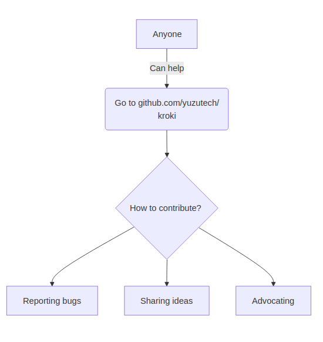
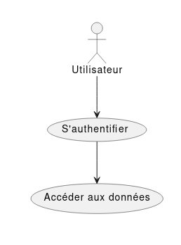
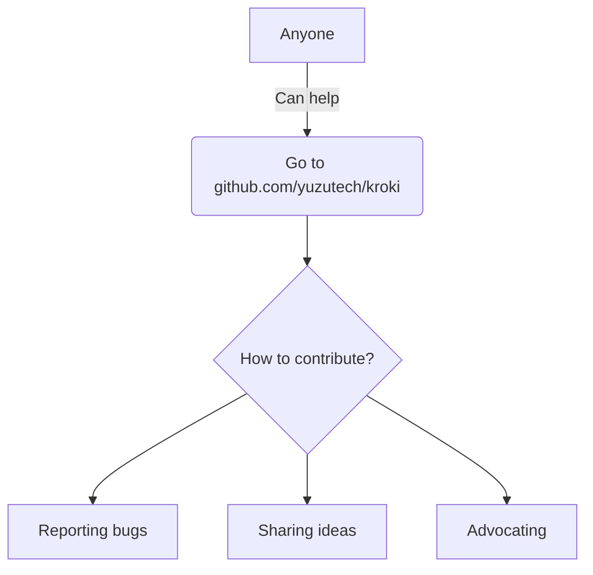
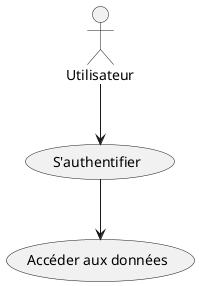
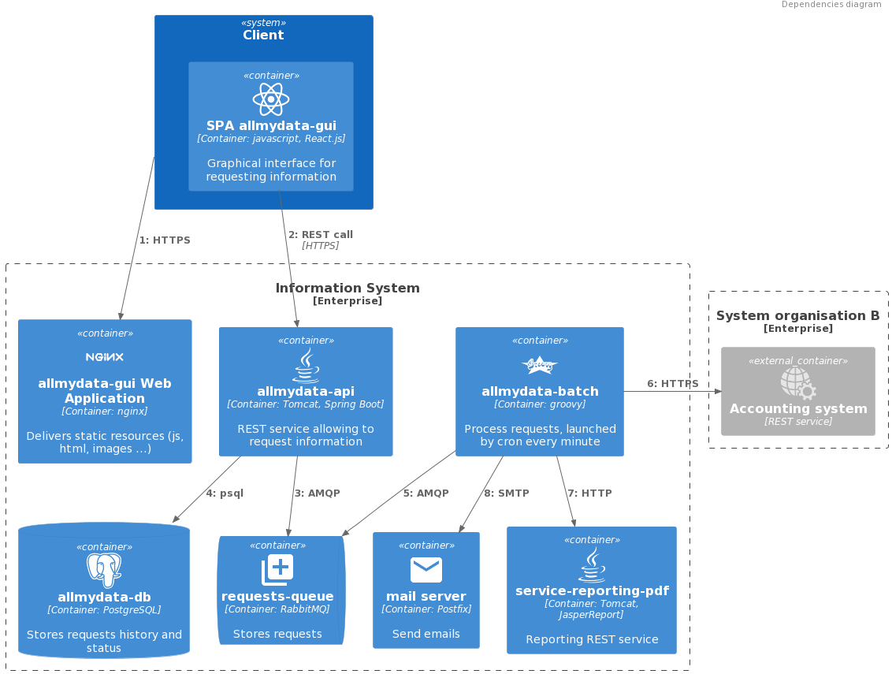
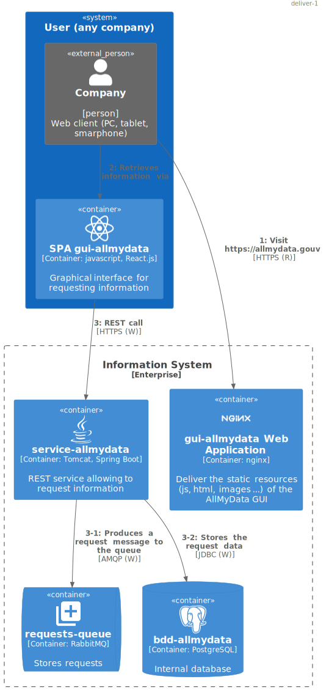
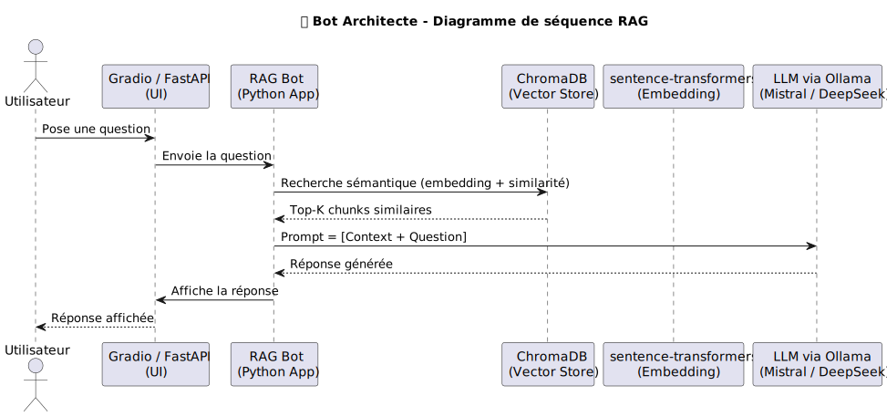

<!--
backgroundImage: url('./images/couverture.png')
backgroundSize: cover
color: white
-->

<br/><br/><br/><br/><br/><br/><br/><br/><br/><br/><br/>
Meetup Arkup Juin 2025
https://meetup-arkup-juin-2025.florat.net/
© 2025 Bertrand Florat – CC BY-SA 4.0 

---
<!--
backgroundImage: none
color: #555555
-->

# 🧭 Agenda (1H)

* 0 - Les enjeux de la documentation (générale et d'architecture)
* 1 - Les challenges de la documentation traditionnelle
* 2 - La documentation d'architecture As Code
* 3 - Les challenges de la doc As Code
* 4 - Take-away & perspectives

---

# 📚 0 — Les enjeux de la documentation
(en général et en architecture en particulier)

---

## ⚠️ Disclaimer

- La **documentation** est, selon moi, particulièrement **incomprise** et **mal maîtrisée** par les équipes.
- Le plus souvent :  
   - 🗂️ **Trop** de documentation...  
   - 📉 **Pas assez** de documentation...  
   - 📄 **Pas le bon niveau** de documentation...  
   - ☠️ **Documentation morte** (non à jour, jamais lue) 

---

## 📈 Le ROI de la documentation

- **Une activité qui dérape très facilement :**
  - Documentation inutile, hors sujet, inmaintenable
  - Coût élevé, retour hypothétique voire négatif
  - En **Lean**, on appelle ça du **Muda** (gaspillage)

- **Écrire une doc, c’est un engagement :**
  - Beaucoup aiment écrire, peu souhaitent maintenir
  - Écrire implique de maintenir dans la durée ⚠️

---

# 📊 Temps passé par un·e architecte à produire de la documentation  

- Conception & réflexions techniques : 30–40 %  
- **Rédaction de documentation : 20–30 %** (15 % sur projets très agiles, 40 % dans les secteurs très réglementés)  
- Réunions & arbitrages : 20–30 %  
- Communication & vulgarisation : 10–15 %  
- Veille technologique : 5–10 %  

---

# 📢 Pourquoi documenter ?  

## 🌍 **Communiquer des informations importantes**  

- 📡 **Dans l’espace** :  
   - Organisations **distribuées**, télétravail, décalage horaire…  
- ⏳ Mais surtout **dans le temps** :  
   - Pour les autres : **TMA**, futurs développeurs, architectes…  
   - Pour soi-même dans 6 mois 😅  
   - Pour les **transferts de compétences**, etc.

---

## 🛡️ **Documenter pour avancer**  

- 🚫 Moins de malentendus ➔ **économies** de temps, d’argent et de frustrations  
- 📚 **Tracer les choix et leurs raisons** (ex. : ADR) ➔ éviter de reposer sans cesse les mêmes questions  
- 🔄 Si besoin, on pourra toujours les réévaluer plus tard… mais en conscience.

---


# 📌 Ce que la documentation doit contenir

- **TOUT** ce qui est nécessaire, mais **QUE** ce qui est nécessaire

- 🧪 **Tests de Litmus** : Dois-je documenter ?
  - Une **personne externe compétente** dans le domaine a-t-elle besoin d’explications complémentaires au code/écrans ? Si non ➔ pas de doc  
  - Documenter essentiellement **ce qui ne peut pas être deviné** (ex. : respect d’une réglementation)  
  - Répondre à la plupart des « **WTF** » d’une nouvelle personne sur le projet  
  - Est-ce que je l’**afficherais au mur** dans l’open space ?

---

# 🚫 Et ne doit pas :

- Contenir du bullshit inutile :  
  - **Historique**, **détails inutiles**, **règles de l’art**, éléments **vagues** ou trop généraux

- **Répéter** (principe DRY 🔄) :  
  - Préférer référencer les documents existants

- Contenir **des informations éphémères**

- **Compenser du code peu explicite** (voir *Clean Code* / *Screaming Architecture* 📖)

- Être **inadaptée** à son audience 🎯

---

## 📋 Petit exemple fonctionnel

Une application d’état civil permet de saisir les dates de naissance avec **trois champs entiers** et non pas un **Date Picker**

**WTF ????**

Que doit contenir (ou pas) la doc dans ce cas ?

---

## 💬 Avez-vous un problème de doc ? Comptez les... :

    🙄 "Ça doit être quelque part dans Confluence…"

    😅 "Je l’ai fait, mais je ne sais plus comment…"

    🤔 "Tu peux demander à Maurice, c’est lui qui sait…"

    🫣 "Ah oui, le guide de DEV… mais il n’est plus à jour depuis 2021…"

---

✅ Bonne documentation

  * **Accessible** : trouvable en deux clics ou via une recherche simple
  * **Pertinente** : adaptée au public (développeur, ops, manager…)
  * **Actionnable** : apporte des exemples concrets, des commandes, des extraits de code
  * **Vivante** : maintenue à jour, intégrée dans les cycles de développement

❌ Mauvaise documentation

  * **Inaccessible** : fichiers perdus, wiki abandonné…
  * **Encyclopédique** : trop de détails inutiles, illisible
  * **Vague** : « Il faut configurer le proxy »… Mais comment ?
  * **Périmée** : décrit un monde qui n’existe plus

---

## 📖 La documentation vivante (Cyrille Martraire)

> « Une documentation fiable, utile, et toujours à jour. »

### ✨ Principes clés

- ✅ **Fiable** : toujours en phase avec le logiciel livré, à tout moment  
- ⚙️ **À faible effort** : facile à maintenir, même lors de changements  
- 🤝 **Collaborative** : favorise les échanges et le partage de savoir  
- 🔎 **Porteuse de sens** : met en lumière les enjeux, déclenche des retours et aide à mieux décider

---

## ❓ Quid de la documentation d’architecture en particulier ?

- Tout ce qui a été dit précédemment s’applique aussi aux documents d’architecture

- Préférer les diagrammes au texte (**UML**, **C4**, **BPMN**, **ArchiMate** en particulier)

- Ne pas hésiter à commenter les diagrammes (directement dans le diagramme ou dans le document parent avec des détails pertinents : **tips / warnings**)

- Être honnête :  
  - Lister les hypothèses d’architecture et études en cours dans un chapitre **« Points non statués »** pour chaque vue  
  - L’incertitude doit être **affichée, pas masquée**

---

## 📚 Les documentations principales de l’architecte

- 🏗️ **Dossier d’Architecture (DA)**  
  Vue d’ensemble des choix, contextes, exigences et contraintes

- 🧠 **ADR – Architecture Decision Records**  
  Journal des décisions d’architecture, horodatées et justifiées

- 📝 **Suivi des points d’architecture**  
  Comptes-rendus des réunions, discussions et arbitrages techniques

- 🔐 **Études techniques** (sécurité, performance, etc.)  et bilans de **POC**
  Analyses approfondies pour justifier ou évaluer des solutions

- 🎤 **Supports de présentation**  
  Slides pour comités d’architecture, parties prenantes, équipes
---

## 🛑 Les diagrammes : anti-patterns principaux

- Mélange de **niveaux d’abstraction** différents

- Trop d’éléments (**~ > 20**)

- Métaréprésentations floues :  
  - Pas de légende  
  - Trop de couleurs, formes, types de flèches  
  - Légendes difficiles à comprendre

- Flèches à **double sens** 🔁 (on ne sait pas qui initie la communication)

---


---

## ✅ Les diagrammes : bonnes pratiques principales

- Métaréprésentations **simples**, niveau d’**abstraction homogène**, **nombre raisonnable** d’éléments

- **Actions explicites sur les flèches**  
  - Indiquer le type d’échange ou de flux  
  - Indiquer la nature du flux (lecture / écriture / exécution), si utile

---

### Exemple C4 : diagramme de container


---

# 🗃️ 1 - Le problème avec la documentation traditionnelle

---

## 💡 Ce que j’entends par « documentation traditionnelle »

Répond à la plupart de ces critères :

- **Documents bureautiques** binaires : Word, PDF, PowerPoint… (même partagés)

- **Statique et figée** dès sa publication

- **Mise à jour fastidieuse** → risque élevé de **devenir rapidement obsolète**

- **Traçabilité des modifications** faible ou manuelle

- Peu intégrée aux **outils et processus de développement**

- Existe uniquement comme livrable d’un **processus**, pas orientée produit

---

## 🗃️ Faible évolutivité et traçabilité

* Peu ou pas de **collaboration active** avec les parties prenantes  
  - Décisions prises en silo  
  - Peu adapté aux revues par pair (suivi des modifications mais pas de MR)

* Faible **traçabilité des évolutions**, en particulier sur les **diagrammes** (binaires)

* Difficulté en cas de **renommage** ou de réorganisation  
  - Références croisées cassées  
  - Renommages / refactorings risqués et peu pratiques sur un lot de documents

---

## 🤖 Une doc moins adaptée aux LLM

* Outils bureautiques **peu formels** : structure faible, pas de validation possible du contenu ou des métadonnées (type Git hooks)

* Perte de sens en cas d’**entraînement de LLM**  
  - Contenu essentiellement binaire, peu structuré, plus difficile à exploiter par l’IA  
  - Plus difficile de faire générer du contenu

---

## 🔒 Plus de risques de fuite

- Aspiration de drives partagés  
- Export et diffusion incontrôlés des fichiers  
- Métadonnées oubliées (ex. : devis pour un autre client…)  
- 📈 **Volumétrie importante** (surtout en cas de multi-versions)

---

## ⏱️ Des efforts de mise en page importants

- Trop de temps consacré à la **mise en page** du texte et au **polissage des diagrammes**  
- Esthétique privilégiée au détriment du fond  
- Création de **diagrammes figés** nécessitant de lourdes reprises pour toute modification  
- Peu de **réutilisation** et pas de factorisation des représentations

---

# 🚀 2 – La Documentation As Code

---

## 🏛️ Documentation traditionnelle vs As Code


| Traditionnelle 📚              | Vivante / As Code 💻                        |
|-------------------------------|--------------------------------------------|
| Fichiers Word / PDF statiques | Documentation versionnée (Git)             |
| Mise à jour manuelle          | Mise à jour via PR/MR / CI/CD              |
| Peu ou pas de traçabilité     | Historique, tags et auteurs tracés         |
| Rapide obsolescence           | Mise à jour continue                       |
| Non intégrée aux workflows    | Intégrée dans le cycle DevOps              |
| Lecture linéaire              | Navigation hypertexte                      |
| Diagrammes figés              | Diagrammes générés à partir du code        |
| Peu collaborative             | Collaboration via revues de code / MR/PR   |

---

🎯 **En résumé** : passer d’un document que l’on subit à un **actif vivant et maîtrisé** du projet

---

## 🧰 Utiliser Git pour documenter efficacement

- **Historique complet** : chaque modification est enregistrée  
- **Tags** : versionnez les jalons de votre documentation (v1.0, v2.0...)  
- **Blame** : savoir *qui* a écrit *quoi*, et *quand*  
- **Diffs** : comparaison facile entre deux versions  
- **Revue via merge request / pull request**  
- **Revenir dans le temps** : checkout d’une version antérieure  

---

## 🥷 Et au-delà de Git de base

- **CI/CD** pour valider / publier automatiquement votre doc (PDF, HTML…)  
- **Git hooks** : automatiser la mise à jour d’index ou de métadonnées  
- **Traçabilité / conformité** via signature GPG sur commits/tags (utile dans les environnements sensibles)  
- **Collaboration distribuée** : plusieurs auteurs, plusieurs branches  

---

## 📄 L’intérêt des langages de balisage légers : AsciiDoc / Markdown

- **Lisibles en brut** : pas besoin d’outil pour lire ou modifier  
- **Simplicité** : syntaxe intuitive pour écrire vite  
- **Faciles à générer** : ex. : spécifications exécutables, rapports de tests Spock  
- **Faciles à versionner** : parfait pour Git (diffs propres, pas de binaire)  
- **Intégration continue** : générer HTML, PDF, diagrammes, SBOM, etc.  
- **Extensibles** : AsciiDoc permet des blocs structurés (admonitions, macros, includes…)

---

## 🎯 Idéal pour de la doc "as code"

> Les formats Markdown / AsciiDoc :  
> - ✅ S’intègrent naturellement à votre code source (de préférence dans le même dépôt)  
> - ✅ Évitent les formats fermés ou verbeux (Word, PDF, XML)  
> - ✅ Permettent l’automatisation, la réutilisation et une documentation vivante

📘 Utilisés par : GitHub, GitLab, Red Hat, Spring, Kubernetes…

---

## 🏆 Pourquoi AsciiDoc pour la doc technique avancée ?

- **Structure riche** : sections, blocs, tableaux complexes  
- **Macros & includes** : contenu réutilisable, factorisable  
- **Index, glossaires, bibliographies**  
- **Admonitions** : `NOTE`, `TIP`, `CAUTION`, etc.  
- **Diagrammes intégrés** : PlantUML, Mermaid…  
- **Sorties variées** : HTML5, PDF, DocBook…


---

## ⚙️ Comparaison d'outils de documentation As Code

<!-- _class: small -->

| Outil          | Format source              | Stack technique       | Points forts                                        | Limites                                       |
|----------------|----------------------------|------------------------|----------------------------------------------------|----------------------------------------------|
| **Docusaurus** | Markdown                   | React + Node.js        | UX moderne, thèmes, blog, versioning               | Moins adapté aux docs backend/archi          |
| **Antora**     | AsciiDoc                   | Ruby (Asciidoctor)     | Multi-repo, modulaire, orienté architecture        | Plus sobre, nécessite structuration stricte  |
| **MkDocs**     | Markdown                   | Python (YAML config)   | Léger, rapide, nombreux plugins                    | Moins modulaire que Antora                   |
| **Sphinx**     | reStructuredText / Markdown | Python                | Puissant, utilisé pour Python/docs API complexes   | Syntaxe plus lourde, moins design            |
| **GitBook**    | Markdown (SaaS ou CLI)     | Web/SaaS ou Node.js    | Très simple, beau rendu, collaboration             | Cloud-centric, moins d’automatisation, **propriétaire**        |
| **AsciiDoc**   | AsciiDoc                   | Ruby (Asciidoctor)     | Syntaxe riche, blocs, admonitions, includes        | Moins répandu que Markdown, learning curve   |

---

🎯 **Quel outil pour quel usage ?**

- 🖥️ **Docusaurus** : produit/API, design et navigation moderne  
- 🧱 **Antora** : doc d'archi, microservices, équipes distribuées  
- 🚀 **MkDocs** : doc rapide à mettre en place, mono-repo  
- 🐍 **Sphinx** : API Python complexes, génération PDF/HTML  
- ☁️ **GitBook** : équipes non techniques, onboarding, guides  
- 🔧 **AsciiDoc seul** : doc technique avancée, sans framework  


---

## 🚀 Antora : plateforme de doc modulaire

- **Organisation par composants, versions, modules**  
- **Multi-dépôts Git** : chaque équipe gère sa doc dans son propre repo  
- **Mise à jour automatique** des sources  
- **Navigation unifiée** sur un portail de documentation  
- **Thématisation et publication pro** (docs produit, API, guides…)

> ✅ Parfait pour la doc d’architecture, les microservices, et la documentation produit distribuée

---

## ✅ Les Spécifications Exécutables

- Traduction directe d’une **exigence** en un **test automatisé**
- Structuration des tests en **Gherkin** (Given / When / Then)
- Servent à la fois à :  
  - **Documenter** les comportements attendus  
  - **Vérifier** en continu leur respect  
- Forme lisible par les humains : développeurs, PO, QA…

---

## 🧪 Exemple de spécification avec Spock

```groovy
class CalculatriceSpec extends Specification {

  def "La somme de deux nombres – Gherkin style"() {
    given: "une calculatrice"
    def calculatrice = new Calculatrice()

    when: "je calcule la somme de #a et #b"
    def resultat = calculatrice.somme(a, b)

    then: "le résultat doit être #result"
    resultat == result

    where:
    a  | b  || result
    1  | 2  || 3
    0  | 0  || 0
    -1 | 1  || 0
  }
}
```

---

## 📄 Génération automatique de documentation

- Avec un plugin Spock Reports + conversion AsciiDoc/HTML/PDF
- Exemple de sortie :

```adoc
== Spécification : CalculatriceSpec

=== la somme de #a et #b doit être #result

[cols="1,1,1"]
|===
| a | b | result
| 1 | 2 | 3
| 0 | 0 | 0
| -1 | 1 | 0
|===
```
---

## 🎯 Bénéfices concrets

- Plus de divergence entre le code, les tests et la documentation
- Vérifiables automatiquement à chaque build
- Réutilisables pour l'audit, l'architecture, la conformité, etc.

---

## 🔄 Exemple de site Antora multi-dépôts à partir de documentation générée

Visualisation des spécifications sur un portail de documentation :


---

## 🛠️ Outils de diagrammes textuels

- Description des **diagrammes en texte brut**
- Stockables dans Git, versionnables, diffables
- Intégrables dans les docs AsciiDoc/Markdown
- Générables automatiquement dans les pipelines CI/CD

**Exemples populaires :**
- **Mermaid** : syntaxe simple, intégré à GitHub, Obsidian, VS Code...
- **PlantUML** : très expressif, idéal pour la modélisation logicielle (UML, C4…)
- **Kroki** : plateforme qui agrège plus de 20 moteurs de rendu de diagrammes

---

### ✍️ Exemples de syntaxe

#### Mermaid (séquence)





#### PlantUML (use case)



> Résultat : un diagramme lisible, versionnable, reproductible !

---

### 🔧 Autres outils de diagrammes textuels

| Outil               | Points forts                                           | Format(s)      |
|--------------------|--------------------------------------------------------|----------------|
| **Graphviz / DOT** | Graphes orientés (DAG, dépendances)                    | `.dot`         |
| **Draw.io CLI**    | Interface graphique avec export en ligne de commande   | `.drawio`      |
| **Structurizr DSL**| Modélisation C4 sous forme textuelle                   | `.dsl`         |
| **Nomnoml**        | UML simplifié avec une syntaxe proche de Markdown      | `.nomnoml`     |
| **Kroki**          | Service centralisé prenant en charge +10 formats       | API, distant   |

---

### ⚙️ Intégrations populaires

<!-- _class: small -->

- **IDE** :
  - **IntelliJ** : support natif de PlantUML, Mermaid via plugins
  - **VS Code** : extensions pour Mermaid, PlantUML, Graphviz, Kroki
  - **Obsidian** : Mermaid intégré, PlantUML via plugins

- **Outils de documentation** :
  - **Antora**, **MkDocs**, **Asciidoctor**

- **CI/CD** :
  - Génération automatique via CLI ou via **Kroki**

- **Plateformes** :
  - **GitHub**, **GitLab** : prévisualisation automatique intégrée

---

## 🧱 Le modèle C4 — Définition

- Un ensemble d’**abstractions hiérarchiques** :  
  *systèmes logiciels*, *conteneurs*, *composants* et *code*

- Un ensemble de **diagrammes hiérarchiques** :  
  *contexte système*, *conteneurs*, *composants* et *code*

- **Indépendant de la notation**  
  (UML, texte, diagrammes libres…)

- **Indépendant des outils**  
  (Structurizr, PlantUML, AsciiDoc, etc.)

---

## 🧱 Le modèle C4 — Diagrammes


Source : https://c4model.com/

---

## 👷 C4 dans la vraie vie

<!-- _class: small -->

- À coupler avec **PlantUML** (support intégré nativement)
- Mes diagrammes préférés :
  - **System Landscape** (en remplacement du diagramme de contexte), utile pour l’architecture globale
  - **Diagramme de conteneur** : le plus utilisé de loin
  - **Diagramme de déploiement** : pour représenter l'infrastructure
- Les **diagrammes dynamiques** (type séquence) sont une version améliorée des diagrammes de séquence UML
- Éviter l’abus de diagrammes de **composants** (risque de sur-documentation) et de **code** (niveau UML)
- Utiliser les **sprites** (plusieurs milliers inclus dans PlantUML)
- C4 est parfois **moins adapté qu’Archimate** dans certains contextes : urbanisation SI, EA, TOGAF, ou outillage spécifique


<div class="admonition tip">
  💡 <strong>Remarque :</strong> Je n’aime pas le terme <i>diagramme de conteneur</i>.  
  Je préfère utiliser le terme <i>diagramme d’unités déployables</i>, que je trouve plus explicite.
</div>


---

## 💡 Exemple de C4 en plantuml


```
@startuml
   !include <C4/C4_Container>
   !include <tupadr3/devicons2/chrome>
   !include <tupadr3/devicons2/java>
   !include <tupadr3/devicons2/postgresql>
   LAYOUT_LEFT_RIGHT()
   Container(browser, "Browser","Firefox or Chrome", $sprite="chrome")
   Container(api_a, "API A","Spring Boot", $sprite="java")
   ContainerDb(db_a, "Database A","Postgresql", $sprite="postgresql")
   Rel(browser,api_a,"HTTPS")
   Rel_R(api_a,db_a,"pg")
@enduml
```

---

## 🥷 La factorisation des diagrammes
<!-- _class: small -->
Les diagrammes As Code permettent la factorisation de librairies (à utiliser en plantuml avec `remove @unlinked`) :

```
fragments.iuml:

!startsub dmz
  Container(browser, "Browser","Firefox or Chrome", $sprite="chrome")
  Container(api_a, "API A","Spring Boot", $sprite="java")
  Container(api_b, "API B (hors contexte)","Python", $sprite="python")
!endsub
!startsub intranet
  ContainerDb(db_a, "Database A","Postgresql", $sprite="postgresql")  
!endsub
!startsub extranet
  ContainerDb(db_b, "Database B","Postgresql", $sprite="postgresql")
!endsub

File diags-1.puml:
@startuml use-case-1
  remove @unlinked
  !includesub fragments.iuml!dmz
  !includesub fragments.iuml!intranet
    
  Rel(browser,api_a,"HTTPS")
  Rel_R(api_a,db_a,"pg")
@enduml
```

---

## 🥷 Pattern : diagrammes d'inventaire

- Regrouper les unités déployables dans des **librairies réutilisables**, découpées par zones fonctionnelles.
- Intégrer dans le DA (vue applicative) une **big picture** de l'inventaire, sans afficher les relations.


---

## 🥷 Pattern : diagrammes dynamiques

- Intégrer dans le DA (vue applicative) une **big picture** des principales dépendances applicatives.



---

## 🥷 Pattern : diagrammes de chaîne de liaison

- Pour chaque feature, représenter une **chaîne de liaison synchrone** composée d’appels successifs.



---

## 🥷 La notion de coordonnées d’architecture

- Si un DA contient **des dizaines voire des centaines de diagrammes**, il devient difficile de s’y référer précisément (par exemple, pour discuter d’un flux en production).
- Nous découpons les **features** en *x* chaînes de liaison synchrones de *n* appels.
- Exemple de coordonnées pour un flux :  
  Flux numéro 5 de la chaîne numéro 3 de la feature _enregistrement de la commande_ → `timeout sur com-3:5`  
  ➔ Référence directe dans les **tickets**, **post-mortems**, **alertes**, etc.

---

## 🗂️ Le Dossier d’Architecture *As Code*

- Basé sur du **light markup** (idéalement **AsciiDoc**)
- Diagrammes **textuels** intégrés (PlantUML, Mermaid…)
- Utilisation de **Git** et des **Merge Requests** pour la collaboration
- Peut être **rendu et consolidé** dans un site **Antora**
- “Développé” dans un **IDE** (VS Code recommandé)
- **Mis à jour en continu**, avec une **revue annuelle complète**

---

## 📘 Mon modèle de dossier d’architecture
<!-- _class: small -->


**https://github.com/bflorat/modele-da**

  


- Découpe l’architecture solution en **cinq vues**
- Structure chaque vue en **Contraintes**, **Exigences** (ENF : Exigences Non Fonctionnelles) et **Solutions**
- Approche **"check-list"** : aide à ne pas oublier les sujets importants
- **Intègre l’incertitude** (hypothèses / points à statuer…)
- Licence **CC Attribution - Partage dans les mêmes conditions**
- Existe aussi en **version anglaise**
- **Prêt à l’usage** : modèles vierges, manuel utilisateur, outils d’export…
- **Amélioration continue** – Contributions bienvenues !
---
## 📄 Les ADR (Architecture Decision Records)

<!-- _class: small -->

- Un **dossier d’architecture** (DA) ne doit intégrer **que la solution retenue**
- L’**historique des choix** et leurs raisons figurent dans des **ADR associés**
- Objectif : **permettre la compréhension des décisions a posteriori** et faciliter leur **partage**
- Un bon ADR doit être : **court**, **clair**, **pertinent**, **accessible**, **traçable** (Git), **transparent**
- Plusieurs formats possibles — je recommande celui de **ThoughtWorks** :
  - 🕓 **Historique** et **statut actuel**, avec noms des validateurs
  - 📚 **Contexte** : description du problème et des options envisagées, avec analyse rapide (forces/faiblesses ou SWOT)
  - ✅ **Décision** : choix clair, non ambigu (ex. : _Solution 2 retenue_)
  - 📌 **Conséquences** : impacts pratiques (besoin en budget, suivi particulier, nouveaux outils...)

---

## ✅ Exemple d'ADR

<!-- _class: small -->

```
## Historique
Statut: `VALIDE`

* Proposé par Jean Dupont le 02/01/2020  
* Validé par l’architecte référent Marie Lefevre le 28 janvier 2020

## Contexte

Le projet nécessite la signature électronique de documents PDF produits par l'application.  
Deux approches ont été envisagées : déléguer la signature à un service externe via API, ou embarquer un composant de signature dans notre propre infrastructure.  
L’objectif est de garantir la conformité eIDAS, la traçabilité, et la résilience de l’opération de signature dans le cadre de traitements massifs (jusqu'à 10 000 signatures/jour).

## Solution 1 : Utilisation d’un service externe de signature (ex : DocuSign, Yousign)

### Forces
- Aucun composant de signature à maintenir côté client
- Conformité eIDAS assurée par le prestataire

### Faiblesses
- Dépendance à un prestataire externe
- Coût unitaire à la signature

### Opportunités
- Possibilité d’intégrer un système de signature qualifiée à terme
- Délégation des audits de sécurité et de conformité

### Risques
- [rédhibitoire] Nécessite une signature synchrone (en ligne) → problème pour nos traitements batch
- Risque de saturation de l’API à forte volumétrie

## Solution 2 : Intégration d’une brique de signature locale (ex : DSS + HSM interne)
[...]

## Décision

La **Solution 2** est retenue.  
Elle offre une meilleure résilience et une intégration plus souple dans notre architecture technique, notamment pour les traitements par lot.

## Conséquences

- Prévoir la montée en compétence de l’équipe sur le module DSS et l’API Java associée
[...]
```

---

## 🥷 Consolidation automatique des ADR

<!-- _class: small -->

Grâce aux **blocs structurés AsciiDoc**, il est possible de **consolider automatiquement** le statut de toutes les ADR dans un **tableau récapitulatif**.

> ✅ Idéal pour suivre les décisions en cours, validées ou obsolètes  
> 📊 Générable automatiquement via un script ou une extension AsciiDoctor


```
.Table Liste et statuts des ADR RECE
[cols="2,1a,4a"]
|===
|ADR |Statut |Historique

|link:001-dedoublonnage-requetes.adoc[001-dedoublonnage-requetes]
|include::001-dedoublonnage-requetes.adoc[tags=statut]
|include::001-dedoublonnage-requetes.adoc[tags=historique]

|link:002-appels-synchrones.adoc[002-appels-synchrones]
|include::002-appels-synchrones.adoc[tags=statut]
|include::002-appels-synchrones.adoc[tags=historique]
...
|===
```

---

# 🗣️ L'importance de L'UL (Ubiquitus Language)

- UL issu du **Domain-Driven Design (DDD)** d’Eric Evans  
- Objectif : **un langage partagé** entre développeurs, experts métier, testeurs et architectes  
- Le DA (dossier d'architecture) **doit refléter ce langage** :
  - 📘 Utiliser **les mêmes termes métier** partout (code, doc, tests, diagrammes)  
  - 🚫 **Éviter les synonymes** et les variations  
- 🤝 Favorise la compréhension entre les parties prenantes  
- 🔎 Améliore la traçabilité des concepts métier  
- ✅ Garantit la cohérence entre code et documentation  

---

# 📝 Le compte-rendu d’un point d’architecture

- **« Commite » le point** : sans CR, la réunion n’a jamais eu lieu.
- **Complète les ADR** et permet de justifier les décisions ou de retracer l’historique.
- Fondamental pour l’architecte : il **clarifie les idées** et documente les échanges.
- Une fois le CR validé, **mettre à jour le DA et/ou les ADR** concernés.
- À rédiger en **light markup** (de préférence **AsciiDoc**)  
  ➔ et à **conserver tous les CR**, idéalement dans des fichiers regroupés par thème ou date, pour faciliter la recherche (ex : `Ctrl+F`)
- Envoyer le **lien du CR par e-mail** (éviter les pièces jointes)
- Accepter les **corrections ou compléments** via **Merge Request** de préférence.

---

### 🧾 Format conseillé :
- **Date**
- **Liste des participant·e·s**
- **Informations clés**
- **Décisions prises**
- **Actions à mener** (formulées en mode **SMART**)

---

# 🖥️ Les supports de présentation *as code*

## 🎯 Pourquoi présenter *as code* ?

- **Écriture textuelle** simple (Markdown, AsciiDoc)
- **Versionnable** avec Git
- **Réutilisable** et **automatisable**
- **Indépendant des outils propriétaires** (PowerPoint, Google Slides) – 🆓 gratuit
- Compatible avec les **LLM** (mise en page, émoticônes, rédaction, orthographe)  
  ➔ facile à parser pour alimenter un modèle d’architecture interne  
  ➔ **Productivité x2**

<div class="admonition tip">
  💡 Ce support a été rédigé avec Marp, assisté de ChatGPT 4o et Mistral 7B
</div>

---

## 🛠️ Outils Open Source populaires

| Outil         | Langage     | Caractéristiques clés                        |
|---------------|-------------|----------------------------------------------|
| **Marp**      | Markdown    | Compatible avec VS Code, export PDF/HTML     |
| **Reveal.js** | HTML/Markdown | Hautement personnalisable avec JS/CSS      |
| **Asciidoctor Reveal.js** | AsciiDoc | Reveal.js mais en Asciidoc          |

---

## 🤖 Tirer profit de la CI/CD pour la documentation *As Code*

<!-- _class: small -->

- **Exports automatiques** vers différents formats :
  - ✅ Idéal : une **archive contenant les HTML** + **diagrammes en SVG**
  - 📄 PDF : rendu correct mais parfois imparfait (surtout pour les grands diagrammes)
  - ❌ Docx / ODT : peu recommandé…

- **Traitements automatisés** :
  - Inclusion de texte, notices de copyright, filtrage selon le public cible...
  - Découpage en modules ou pages selon la structure du DA

- **Analyses & contrôles** automatiques :
  - Vérification d’éléments sensibles (copyright, données personnelles…)
  - Indicateurs d’avancement du remplissage d’un Dossier d’Architecture (taux de couverture…)

- **Génération de documentation depuis le code** :
  - Exemple : détection d’annotations `@Good` dans le code ➔ export automatique vers une page de documentation Antora ➔ utile pour les nouveaux arrivants


---

## 🔎 La doc au plus près du code… mais où ?

- Placer la **conception détaillée** directement dans le dépôt Git du projet.
- Pour un **petit projet mono-module**, intégrer le DA dans le même dépôt que le code.
- Pour la plupart des projets, il est préférable de créer un **dépôt Git dédié à la documentation**, regroupant :
  - le Dossier d’Architecture (DA)
  - le suivi (comptes-rendus)
  - les ADR
  - les études techniques


---

## 🛰️ Architecture As Code & Intelligence Artificielle

- Texte ? Ça vous rappelle quelque chose ? ➔ **les LLM** !
- Il est aujourd’hui tout à fait possible de construire un **chatbot d’architecture** spécifique à votre organisation.
- Objectif : 
  - Fournir aux développeurs un **accès rapide et ludique** aux règles d’architecture
  - **Réduire les malentendus**, augmenter l’autonomie
  - Renforcer la **transmission de savoirs implicites**


---
## 🧸 Petit POC : ArchBot

- Entraîné sur des documents d’architecture **AsciiDoc** et **PlantUML**
- Stack : **RAG** (Retrieval-Augmented Generation) basé sur les modèles **Mistral 7B** ou **DeepSeek-V2**
- POC développé en local sur mon PC
- Résultats **mitigés**, mais **nettement meilleurs avec `mistral-7b`**
- Extrêmement lent (pas encore testé sur du matériel adapté)




---
## 🧸 Exemple d'utilisation

### Pré-prompt

```
Tu es un assistant expert en architecture solutions qui répond UNIQUEMENT en français. 
Tu ne travaille que sur un seul projet : FOO. Tu t'appelles 'ArchBot'.
Tes réponses doivent être précises et basées sur les documents techniques fournis.
Si tu ne trouves pas d'information pertinente dans les documents, réponds simplement : 
"Je n'ai pas trouvé d'information pertinente sur ce sujet dans les documents."
Ne fais AUCUNE supposition ni invention.
```

### Utilisation (GUI: Gradio)


---


# 🧨 3 - Les challenges de la documentation As Code

---

## ❄️ Cela reste de la documentation froide


---

## 😓 La documentation, même *As Code*, c’est difficile

<!-- _class: small -->

- Nécessite de bonnes compétences rédactionnelles
- Mais surtout : **de l’empathie** pour identifier le bon niveau de détail  
  (ni trop basique, ni trop complexe pour une personne normalement compétente dans le domaine)

* Wiio’s Laws :

>Communication usually fails except by accident.
If communication can fail, it will.
If communication cannot fail, it still most usually fails.
If communication seems to succeed in the intended way, there’s a misunderstanding.
If you are content with your message, communication certainly fails.
If a message can be interpreted in several ways, it will be interpreted in a manner that maximizes the damage.
[...]


---

## 😱 Épouvante chez les CP ou BA face au Markdown

- Dans la plupart des cas (RETEX), il n’est pas envisageable de faire produire du *light markup* ou des diagrammes *as code* aux non-techniques.
- Blocage fréquent des non-techs face à GitLab ou GitHub.
- **Notre solution** : filière dédiée pour ces profils sur un wiki de type Confluence-like comme [xwiki](https://www.xwiki.org/xwiki/bin/view/Main/WebHome) ou [BookStack](https://www.bookstackapp.com/), avec intégration [diagrams.net](https://app.diagrams.net/) (ex-Draw.io).

<div class="admonition tip">
  💡 Même si c’est conceptuellement moins satisfaisant et qu’il ne faut pas multiplier les outils, je ne crois pas à une solution unique de documentation. L’approche *Best of Breed* est ici préférable.
</div>


---

## 🔄 Comment transférer le DA depuis GitLab vers nos prestataires ?

### 📦 1. Export via CI/CD

- Utiliser une **pipeline CI/CD** pour générer automatiquement :
  - une **archive**, ou  
  - un **PDF** du dossier d’architecture
- Permet un transfert simple, traçable et reproductible

### 🔐 2. Pour les documents sensibles

- Préférer un **accès contrôlé au dépôt Git**
  - Restriction des **droits d’accès réseau** et **droits applicatifs**
  - 🔍 Suivi des accès et **historique Git** pour la traçabilité


---

## ✅ Comment s'assurer que le DA est lu et compris ?

### 🧭 Bonnes pratiques appliquées chez nous :

- 📘 **Livret d’accueil**  
  Contient les sections du DA à lire en fonction du **rôle** (développeur, PO, ops…).

- ❓ **Quiz d’assimilation**  
  Environ 50 questions (30 min), suivi de **4 heures de débrief** avec un architecte, un mois après l’arrivée.

- 📩 **Communication proactive**  
  Envoi de **mails ou messages** à chaque évolution du DA, avec un **lien direct** ou un **extrait ciblé**.


---

## 🎯 Manque de contextualisation de certains modèles de DA

- Certains modèles d’architecture (comme le mien) sont parfois **trop génériques**, ce qui les rend **chronophages** et parfois **intimidants** pour leurs utilisateurs.

- Il est essentiel de **filtrer les sections en fonction du contexte** :
  - Par **typologie d’architecture**  
    (ex : applicative, technique, métier)
  - Par **filière technologique**  
    (ex : projet mobile, cloud, legacy…)

---

## 🧭 Où commence le DA et où s’arrête le guide de DEV ?

- Le **guide de développement** est produit et maintenu par les **LeadTech** et les **équipes de développement**.
- Le **Dossier d’Architecture (DA)** doit énoncer les **principes directeurs de développement**, sans entrer dans les **détails opérationnels** ou les choix d’implémentation spécifiques.


---

### 🧪 Exemple : validation des performances en DEV (DoD)

- Le **DA** spécifie :  
  > Les développeurs doivent réaliser des **mini-benchmarks** avec une montée en charge significative :  
  > **au moins 10 threads** pendant **1 minute minimum**.

- Le **guide DEV** précise :  
  > Où trouver le **template JMeter**,  
  > Comment le **configurer**,  
  > Comment le **lancer**.

---
## 🧭 Où commence le DA et le DEX ?

- Le **DEX** (Dossier d'Exploitation) doit rester **léger**, surtout en contexte **Infrastructure as Code** :
  - Ne **pas détailler les manifestes** ou les **valeurs de configuration** (déjà présentes dans le code).

- Le **DA** se limite à décrire les **principes** et les **technologies utilisées**,  
  sans mentionner les **machines spécifiques** ni les **chronogrammes**.

---

### 💾 Exemple : gestion des sauvegardes

- Le **DA** spécifie :
  > Une **double sauvegarde** de la base PostgreSQL :  
  > `pg_dump` + **sauvegarde Veeam** de la VM,  
  > Avec une **politique de rétention** :  
  > `7` journalières / `5` hebdomadaires / `12` mensuelles / `2` annuelles.

- Le **DEX** :
  > Fait référence au DA  
  > Décrit **comment vérifier** que les sauvegardes s’exécutent correctement

- Le **code** (ex. : CronJob Kubernetes) :
  > Contient l’**expression cron exacte**


---

## 🧩 Architecture as Code : rôle du management

---

### ✅ Comment suivre et valider le cycle de vie du DA ?

<!-- _class: small -->

- 🕵️‍♂️ **Suivi formel** :
  - Définir un **workflow de revue** :  
    ➤ Merge Request avec **approbation obligatoire** de l’architecte ou du manager
  - Mettre en place des **tags de validation** :  
    ➤ Ex. : `#validé-architecte`, `#à-relire`, `#en-cours`

- 📈 **Traçabilité & Qualité** :
  - S’appuyer sur **Git** pour :
    ➤ l’historique,  
    ➤ le `blame`,  
    ➤ des **commits commentés et explicites**
  - Utiliser un **template de MR** :  
    ➤ pour **documenter les impacts** des modifications sur l’architecture


---

## 🤝 Comment s’impliquer dans la qualité du DA ?
<!-- _class: small -->

- 🎯 **Clarifier les attentes** :
  - Qualité rédactionnelle
  - Clarté des rationales
  - Cohérence avec les objectifs stratégiques

- 🧪 **Mettre en place des actions concrètes** :
  - Quiz de validation (ex. un mois après l’onboarding)
  - Relectures collectives (revues par pairs ou par le management technique)
  - Inclusion dans les critères de DoD ou de release

- 🔁 **Ancrer dans les rituels d’équipe** :
  - Revue mensuelle du DA en comité technique
  - Suivi dans les rituels d’équipe : évolutions, arbitrages, changements majeurs


---

# 🧠 4 - Takeaway — Ce qu'il faut retenir

- **La documentation d’architecture** doit être vivante, utile, maintenue et adaptée à son audience.
- **Architecture as Code** = gain de traçabilité, maintenabilité, lisibilité et automatisation.
- **AsciiDoc + Git + CI/CD** → combo gagnant pour une doc versionnée, réutilisable et collaborative.
- Le **DA** donne les **principes** ; les **guides DEV/DEX** précisent les **détails opérationnels**.
- Le **management** peut suivre la qualité du DA via Git, MRs, quiz, revues croisées, etc.
- Modèle recommandé : DA structuré en contraintes / exigences / solutions, avec ADRs et suivis intégrés.

----

## 🚀 Un projet open source en perspective ?

- Améliorer et enrichir le modèle de dossier d’architecture (DA)
- Proposer une **interface CLI** et/ou un **GUI** et/ou un **chatbot** ? pour générer des templates de DA contextualisés
- Pas de base de données nécessaire : tout est stocké **en texte dans un dépôt Git**
- Chaque section du modèle est enrichie de **métadonnées** pour permettre le **filtrage intelligent**

```
🏷️{"id":"5a5f3bc5-7a1d-4f68-8385-8e1a19faf288", 
   "labels":["stockage_persistent", "niveau::avancé", "taille_projet::moyen", "taille_projet::grand"]}
# Gestion des transactions
[...]

🏷️{"id":"a1e81580-8a2d-4d4d-8f99-6c9ae9ace122", 
   "labels":["greenit", "niveau::avancé"], 
   "link_to":"51bc1362-9c2f-4cd8-81d9-face77ed4dc6"}
# Écoconception
[...]
```

----

## 🔗 Liens utiles

- **Cette présentation** (Bertrand Florat) :  
  👉 [https://meetup-arkup-juin-2025.florat.net](https://meetup-arkup-juin-2025.florat.net)

- **Patterns de diagrammes PlantUML / C4** (Bertrand Florat) :  
  👉 [https://florat.net/architecture-as-code-with-c4-and-plantuml/](https://florat.net/architecture-as-code-with-c4-and-plantuml/)

- **Rédiger de bons ADR** (Bertrand Florat) :  
  👉 [https://florat.net/comment-faire-de-bons-adr/](https://florat.net/comment-faire-de-bons-adr/)

- **Living Documentation** (Cyrille Martraire – O’Reilly) :  
  👉 [https://www.oreilly.com/library/view/living-documentation-continuous/9780134689418/](https://www.oreilly.com/library/view/living-documentation-continuous/9780134689418/)


---

# 🙏 Merci pour votre attention !


# ❓ Des questions ? retours, suggestions ?


