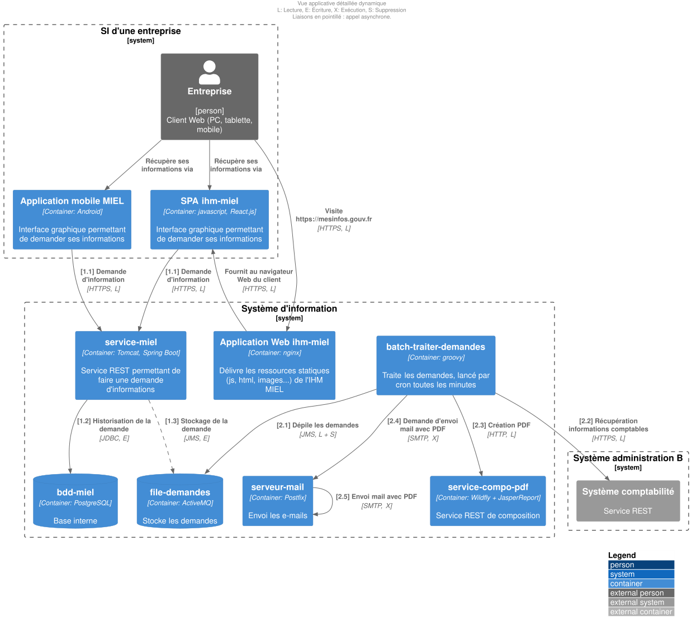

<!--
backgroundImage: url('./images/couverture.png')
backgroundSize: cover
color: white
-->

           
Bertrand Florat 
Meetup Arkup Juin 2025
© 2025 Bertrand Florat – CC BY-SA 4.0 

---
<!--
backgroundImage: none
color: #555555
-->

# 🧭 Agenda (1H)

* 0 - Les enjeux de la documentation (générale et d'architecture)
* 1 - Les challenges de la documentation traditionnelle
* 2 - La Documentation d'Architectrure As Code
* 3 - RETEX, tips, blueprints
* 4 - Take-away & perspectives

---

# 📚 0 — Les enjeux de la documentation
(en général et en architecture en particulier)

---

## ⚠️ Disclaimer

- La **documentation** est l’un des domaines les plus **mal compris** et **mal maîtrisés** par les équipes
- Le plus souvent :  
   - 🗂️ **Trop** de documentation...  
   - 📉 **Pas assez** de documentation...  
   - 📄 **Pas le bon niveau** de documentation...  
   - ☠️ **Documentation morte** (non à jour, jamais lue) 

---
## 📈 Le ROI de la documentation

- **Une activité qui dérive très facilement :**
  - Documentation inutile, hors sujet, inmaintenable
  - Coût élevé, retour hypothétique voire négatif
  - En **lean**, on appelle ça du **Muda** (gaspillage)

- **Écrire une doc, c'est un engagement :**
  - Beaucoup aiment écrire, peu souhaitent maintenir
  - Écrire implique maintenir dans la durée ⚠️

---

# 📊 Temps passé par un.e architecte à produire de la documentation ?  

- 🧩 Conception & réflexions techniques : 30–40%  
- 📖 **Rédaction de documentation : 20–30% (15% sur projets très agiles, 40% dans secteurs très reglementés** 
- 🤝 Réunions & arbitrages : 20–30%  
- 📢 Communication & vulgarisation : 10–15%  
- 📈 Veille technologique : 5–10%  

---

# 📢 Pourquoi documenter ?  

## 🌍 **Communiquer des informations importantes**  

- 📡 **Dans l’espace** :  
   - Organisations **distribuées**, télétravail, décalage horaire...  
- ⏳ **Dans le temps** :  
   - Pour les autres : **TMA**, futurs développeurs, architectes…  
   - Pour soi-même dans 6 mois 😅 ou pour les **transferts de compétence** !   

---

## 🛡️ **Documenter pour avancer**  

- 🚫 Moins de malentendus ➔ **Économies** de temps, d’argent et de frustrations
- 📚 **Tracer les choix et leurs raisons** ➔ éviter de reposer sans cesse les mêmes questions
- 📖 Utiliser des **Architecture Decision Records (ADR)** pour tracer les décisions importantes
- 🔄 *Si besoin, on pourra toujours les réévaluer plus tard... mais en conscience.*  

---

# 📌 Ce que la documentation doit contenir

- **TOUT** ce qui est nécessaire, mais **QUE** ce qui est nécessaire

- 🧪 **Tests de Litmus** : Dois-je documenter ?
  - Une **personne externe compétente** dans le domaine a-elle besoin d'explications complémentaires au code/écrans ? Si non, pas de doc
  - Documenter essentiellement **ce qui ne peut pas être deviné**
  - Répondre à la plupart des « **WTF** » d'une nouvelle personne sur le projet
  - Est-ce que je l'**afficherais au mur** dans l'open-space ?

---

# 🚫 Et ne doit pas :

- Contenir du bullshit inutile :
  - **Historique**, **détails inutiles**, **règles de l'art**, éléments **vagues** ou trop généraux

- **Répéter** (principe DRY 🔄) :
  - Préférer référencer les documents existants

- Contenir **des informations ephemères** (jours à semaines)

- **Compenser du code peu explicite** (voir Clean Code / Screaming Architecture 📖)

- Être **inadapté** à son audience 🎯

---

## 📋 Petit exemple fonctionnel

Une application d'état civil permet de saisir les dates de naissance avec **trois champs entier** et non pas un **Date Picker**

**WTF ????**

Que doit contenir (ou pas) la doc ?

---

## 💬 Avez vous un problème de doc ? comptez les :

    🙄 "Ça doit être quelque part dans Confluence..."

    😅 "Je l'ai fait, mais je ne sais plus comment..."

    🤔 "Tu peux demander à Maurice, c’est lui qui sait..."

    🫣 "Ah oui, le guide de DEV... mais il n’est plus à jour depuis 2021…"

---
✅ Bonne documentation

    📖 Accessible : trouvable en 2 clics ou via une recherche simple

    🎯 Pertinente : adaptée au public (développeur, ops, manager…)

    🛠️ Actionnable : apporte des exemples concrets, des commandes, des extraits de code

    🔄 Vivante : maintenue à jour, intégrée dans les cycles de développement

❌ Mauvaise documentation

    🕸️ Inaccessible : fichiers perdus, wiki abandonné…

    📚 Encyclopédique : trop de détails inutiles, illisible

    🤷 Vague : « Il faut configurer le proxy »… Mais comment ?

    📅 Périmée : décrit un monde qui n'existe plus

---

## Quid de la documentation d'architecturte en particulier ?

- Tout ce qui a été dit précédemment s'applique aussi aux documents d'architecture

- Préférer les diagrammes au texte (**UML**, **C4**, **BPMN**, **ArchiMate** en particulier) 

- Ne pas hésiter à commenter les diagrammes (directement dans diagramme ou dans le document parent avec des détails pertinents (**tips / warnings**)

- Être honnête :  
  - Lister les hypothèses d’architecture et études en cours dans un chapitre **« Points non statués »** pour chaque vue  
  - L’incertitude doit être **affichée, pas masquée**

---

## 🛑 Les diagrammes : anti-patterns principaux

- Mélange de **niveaux d'abstraction** différents

- Trop d'éléments (**~ > 20**)

- Métaréprésentation floue  
  - Pas de légende  
  - Trop de couleurs, formes, types de flèches  
  - Légendes difficiles à comprendre

- Flèches à **double sens** 🔁 (on ne sait pas qui initie la communication)

---

---

## ✅ Les diagrammes : bonnes pratiques principales

- Métaréprésentation **simple**  
  - Peu de couleurs  
  - Peu de types de flèches  

- **Actions explicites sur les flèches**  
  - Indiquer le type d’échange ou de flux  
  - Indiquer la nature du flux (Lecture / Écriture / Exécution) si utile

- Niveau d’**abstraction homogène**  

---
### Exemple C4 : diagrame de container

---

# 1 - Le problème avec la documentation traditionnelle

---

## 🗃️ Ce que j'entends par 'documentation traditionnelle'

Répond à la plupart de ses critères :

- **Documents bureautique** (Word, PDF ou PowerPoint, ...), même partagés

- **Statique et figée** dès sa publication

- **Mise à jour fastidieuse** -> risque élevé de **rapidement devenir obsolète**

- **Traçabilité des modifications** faible ou manuelle

- Peu intégrée aux **outils et processus de développement**

- Existe uniquement parce comme livrable d'un **procesus, pas orienté produit**

---

## 🗃️ Les problèmes de la doc traditionnelles  (1/3)

* 🚪 Peu ou pas de **collaboration active** avec les parties prenantes  
  - Décisions prises en silo  
  - Peu adapté aux revues par pair

* 🕳️ Faible **traçabilité des évolutions**, en particulier sur les **diagrammes** (binaires)

* 🤯 Difficulté en cas de **renommage** ou de réorganisation  
  - Références croisées cassées  
  - Renomages / refactorings risqués et peu pratiques sur un lot de documents

---

## 🗃️ Les problèmes de la doc traditionnelles  (2/3)

* 🕳️ Outils bureautiques **peu formels** :  Structure faible, pas de validation possible du contenu ou des meta-données (type Git hooks)

* 🕳️ Perte de sens en cas d’**entraînement de LLM**  
  - Contenu essentiellement binaire peu structuré, difficile à exploiter par l'IA  
  - Plus diffile de faire générer du contenu

* 🔒 Risque de **fuite d’informations sensibles**  
    - Aspiration de drives partagés  
    - Export et diffusion incontrôlés des fichiers
    - Métadonnées oubliées

---

## 🗃️ Les problèmes de la doc traditionnelles  (3/3)

* 🕒 **Efforts de mise en page** : faible valeur ajoutée

* 📈 **Volumétrie importante** (surtout en multi-versions)

---

## 📚 Confusion des concepts

- Solutions décrites **sans les exigences et contraintes correspondantes**  

- Mélange fréquent entre :  
  - **Contraintes** (imposées par le contexte)  
  - **Exigences** (attendues par le métier)  
  - **Solutions** (choix technologiques)  

- Résultat :  
  - Perte de lisibilité  
  - Difficulté pour justifier les choix faits

---

## ⏱️ Un temps important perdu inutilement

- Trop de temps consacré à la **mise en page** et au **polissage des diagrammes**  
  - Esthétique privilégiée au détriment du fond  

- Création de **diagrammes figés** qui nécessitent de lourdes reprises pour toute modification

- Peu de **réutilisation** et pas de factorisation des représentations

---

## 📉 Une documentation difficile à maintenir

- **Templates de documents rigides** et mal adaptés à l’évolution des projets  

- Difficulté à garantir une **qualité homogène** dans les différents DA produits  

- Risque de production de **documents inutiles ou rapidement obsolètes**

---

# 2- Doc as code

## 🏛️ Documentation d'architecture : Traditionnelle vs Vivante (As Code)

| Traditionnelle 📚          | Vivante / As Code 💻          |
|----------------------------|-------------------------------|
| Fichiers Word / PDF statiques | Documentation versionnée (Git)  |
| Mise à jour manuelle        | Mise à jour via PR / CI-CD    |
| Peu ou pas de traçabilité   | Historique et auteurs tracés  |
| Rapide obsolescence         | Mise à jour continue          |
| Non intégrée aux workflows  | Intégrée dans le cycle DevOps |
| Lecture linéaire            | Navigation hypertexte         |
| Diagrammes figés             | Diagrammes générés à partir du code (PlantUML, Structurizr) |
| Peu collaborative           | Collaboration via revues de code / merge requests |

🎯 **En résumé :** Passer d’un document que l’on subit à un **actif vivant et maîtrisé** du projet

---

Takeaway

Présentatrion disponible à https://florat.net

---

Aller plus loin :

La living documentation (pointeur vers Cyril Martraire)